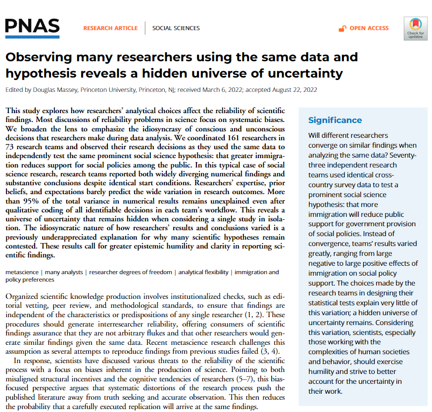
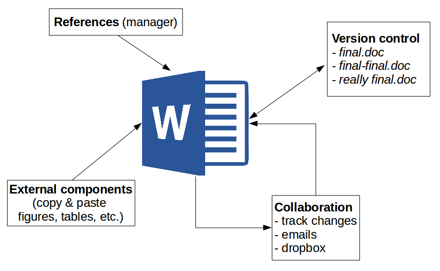
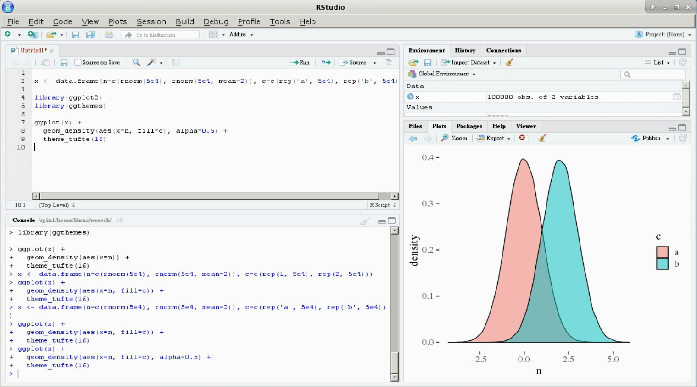
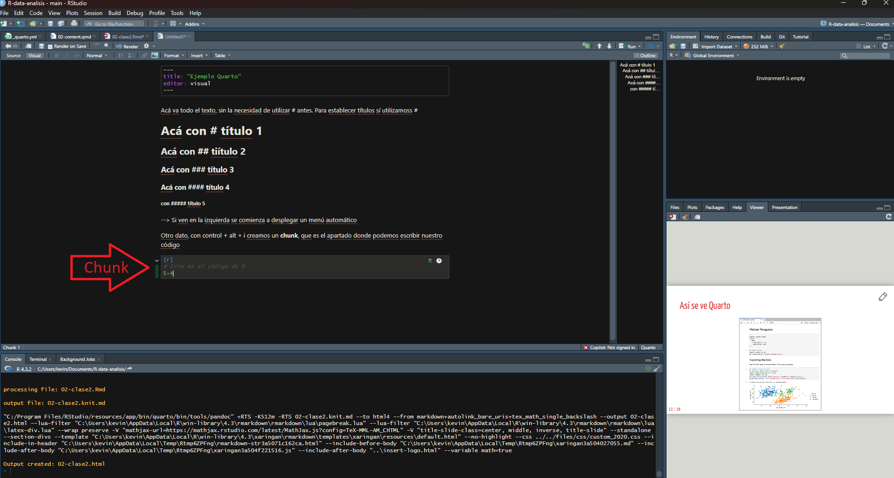
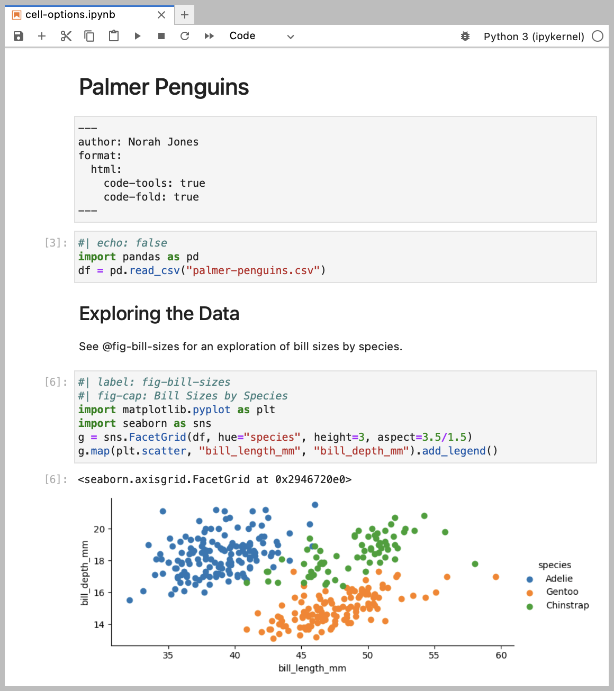

##  {data-background-color="black"}

::: {.columns .v-center-container}
::: {.column width="20%"}
{width="100%" fig-align="center"}
:::

::: {.column width="80%"}
::: rojo
### R para el análisis de datos
**Sesión 2**: Construcción de reportes automáticos, reproducibles e integrados con código
:::

------------------------------------------------------------------------

### **Kevin Carrasco**
### Sociología - UAH
### 1er Sem 2026 
### [R-data-analisis.netlify.com](https://R-data-analisis.netlify.com)
:::
:::

# Investigación reproducible {data-background-color="black"}

## Reproducibilidad

::: {.incremental}


- Es la posibilidad de **regenerar** de manera independiente los resultados usando los materiales originales de una investigación ya publicada.

- En términos simples: obtener los mismos resultados de una investigación utilizando los mismos datos.

:::

## ¿Qué porcentaje de los estudios publicados son reproducibles?

::: {.columns}
::: {.column width="80%"}


:::
::: {.column width="20%"}

Alrededor de un **40%!** dependiendo de la disciplina
:::
:::

## ¿Hay crisis de reproducibilidad?

::: {.columns}
::: {.column width="60%"}

{width="80%"}


:::
::: {.column width="40%"}

Fuente: [Baker (2016) 1,500 scientists lift the lid on reproducibility - Nature](https://www.nature.com/news/1-500-scientists-lift-the-lid-on-reproducibility-1.19970)
:::
:::

## ¿y en la práctica cómo afecta la reproducibilidad?

::: {.columns}
::: {.column width="60%"}
{width="80%"}

:::
::: {.column width="40%"}

Breznau, et. al, (2023) coordinó una investigación con 161 investigadores de 73 equipos de investigación.

Los equipos informaron tanto hallazgos numéricos como conclusiones sustanciales muy diversas
:::
:::


# Flujos de investigación reproducible {data-background-color="black"}

- Texto plano
- Carpetas y archivos
- Autocontenido
- Abierto

## Ejemplo con procesador de texto tradicional



## Ejemplo con procesador de texto tradicional


## Algunas limitaciones

::: {.columns}
::: {.column width="80%"}

- Barrera de **pago/licencia** para acceder a contenidos (propiedad)

- Difícil **versionamiento** y llevar registro de quién hizo qué cambio, barrera a la reproducibilidad y colaboración 

- No permite un documento enteramente **reproducible** que combine texto y código de análisis (en caso de utilizarlo)

:::
::: {.column width="20%"}


::: 
:::

# Propuesta: escritura libre y abierta

## Introducción a R y RStudio

::: {.columns}
::: {.column width="50%"}
{.nostretch fig-align="center" width="300px"}


:::
::: {.column width="50%"}
{.nostretch fig-align="center" width="1000px"}

::: 
:::

## Así se ve Rstudio





## ¿Por qué usar R?

- Gratis: No es necesario pagar licencias

- Multiplataforma (Windows, Mac-OS, Linux): Los códigos de análisis pueden ser usados en distintas plataformas

- Investigación reproducible: Permite documentar los resultados obtenidos paso a paso, mostrando el flujo completo de procesamiento de los datos por medio de **scripts**

- **Integración con otros softwares**

#  Documentos en Quarto


## ¿Qué es markdown?

- Forma de escritura simple con pocas marcas de formato

- Conversión a distintos formatos de salida (html, pdf)

- Soporta encabezados, tablas, imágenes, tablas de contenidos, ecuaciones, links...

- Filosofía: foco en contenido primero, el formato después.

## ¿Qué es Quarto?

- [Quarto](https://quarto.org/) es un sistema moderno de creación de documentos dinámicos, informes, presentaciones, libros, sitios web y más, a partir de archivos de texto plano y por medio del conversor universal de documentos [Pandoc](https://pandoc.org/).

- Evolución de los sistemas de autoría como Jupyter, R Markdown, todo dentro del mismo documento. 

## Características Principales

-   **Multiplataforma**

-   **Basado en Markdown** 

-   **Soporte para múltiples lenguajes** 

-   **Multitud de formatos de salida** 

-   **Soporte para publicación científica** 
  
-   **Integración entornos de desarrollo** (RStudio, VSC, etc)

-   **Extensible** 

---

## Características principales

- Lenguaje que combina código (R) y texto (Markdown): Al igual que RMarkdown (.Rmd), Quarto permite combinar texto plano markdown y código de análisis R.

- Provee una serie de herramientas para generar documentos dinámicos y publicarlos


## Estructura de un documento

- Archivo `.qmd`
- Encabezado YAML:
  ```yaml
  title: "Mi documento"
  author: "Kevin Carrasco"
  date: today
  format: html
  ```
- Cuerpo:
  - Markdown para secciones, énfasis, listas, etc.
  - Bloques de código
  - Bibliografía

## Ejemplo
       
    --- # <1>
    title: "Tutorial Quarto" # <1>
    author: "Kevin Carrasco" # <1>
    date: "2026-03-10" # <1>
    format: html # <1>
    lang: es # <1>
    --- # <1>

    # Bienvenidos a este tutorial de **Quarto**. # <2>

    Quarto está especialmente diseñado para elaborar documentos # <2>
    científicos y técnicos reproducibles
    


## Base de escritura: Markdown

:::: {.columns}
::: {.column width="60%"}
- Encabezados: `#`, `##`, `###`
- Listas:
  - Viñetas: `-` o `*`
  - Numeradas: `1.`, `2.`
- Énfasis: `*cursiva*`, `**negrita**`
- Código en línea: `` `código` ``
- Enlaces: `[texto](url)`
:::

::: {.column width="40%"}

:::
::::


## Ejemplo

    --- # <1>
    title: "Tutorial Quarto" # <1>
    author: "Kevin Carrasco" # <1>
    date: "2026-03-10" # <1>
    format: html # <1>
    lang: es # <1>
    --- # <1>

    # Bienvenidos a este tutorial de **Quarto**. # <2>

    Quarto está especialmente diseñado para elaborar documentos # <2>
    científicos y técnicos reproducibles

    ## Este es un subtítulo

    Ahora vamos a ensayar **negritas** y _cursivas_

    ### Y un título de tercer orden

    Y una lista

    - con viñetas
    - ...
    - ...
  
    Y otra numerada:

    1. punto 1
    2. punto 2
    3. ...
    
    ## Links e imágenes

    [Este es un link a Github](https://github.com/)  

    


## Personalización visual del HTML

- Temas: `cosmo`, `flatly`, `lux`, `darkly`, etc.
- Opciones comunes en YAML:
  ```yaml
  toc: true
  number-sections: true
  code-fold: true
  ```
- Personalización con CSS externo:
  ```yaml
  css: estilos.css
  ```

## Ejemplo

    --- # <1>
    title: "Tutorial Quarto" # <1>
    author: "Kevin Carrasco" # <1>
    date: "2026-03-10" # <1>
    format: html # <1>
    lang: es # <1>
    toc: true
    number-sections: true
    theme: darkly
    css: estilos.css
    --- # <1>

    # Bienvenidos a este tutorial de **Quarto**. # <2>

    Quarto está especialmente diseñado para elaborar documentos # <2>
    científicos y técnicos reproducibles

    ## Este es un subtítulo

    Ahora vamos a ensayar **negritas** y _cursivas_

    ### Y un título de tercer orden

    Y una lista

    - con viñetas
    - ...
    - ...
  
    Y otra numerada:

    1. punto 1
    2. punto 2
    3. ...


## Extensiones

- Integración con R
- Referencias bibliográficas
- Renderizado a pdf, word
- Sitios web
- Presentaciones

## Recursos

- Recursos para seguir aprendiendo:
- [https://quarto.org](https://quarto.org)
- [Creación de documentos científicos con Quarto](https://aprendeconalf.es/quarto-textos-cientificos/)
- [Tutorial Quarto for academics](https://youtu.be/EbAAmrB0luA)

## Así se ve Quarto en Rstudio



## Así se ve Quarto renderizado



# Protocolo de flujo de investigación reproducible {data-background-color="black"}

## Alternativas

::: {.columns}
::: {.column width="45%"}
::: {.fragment .fade-up}

 A. ad-hoc
 
  - cada investigador define numero de archivos, nombres, carpetas y organización
  
  - explicar al resto cómo se organiza
  - documentar en un archivo cómo se organiza
  - --> reproducibilidad y transparencia **LIMITADA**

:::
:::

::: {.column width="5%"}
:::

::: {.column width="45%"}
::: {.fragment .fade-up}

B. *Protocolo* reproducible

  - **estructura** de carpetas y archivos interconectados que refieren a reglas conocidas (estándares)
  
  - **autocontenido**: toda la información necesaria para la reproducibilidad se encuentra en la carpeta raíz o directorio de trabajo.
  
:::
:::
:::


## Propuesta: **Protocolo IPO**


## Estructura IPO


## Mayores detalles y plantilla de carpetas:


- [https://lisacoes.com/ipo-repro/](https://lisacoes.com/ipo-repro/)

- [https://github.com/lisa-coes/ipo](https://github.com/lisa-coes/ipo)

## Carpeta autocontenida

- proyecto **autocontenido**: reproducible sin necesidad de archivos externos

- requisito: establecer **directorio de trabajo**

  - posición de referencia de todas las operaciones al interior del proyecto
  
  - también llamado **directorio raíz**
  
## Directorio de trabajo

- ej. forma tradicional en hoja de código R: 

  - `setwd(ruta-a-carpeta-de-proyecto)`

  - problemas: hace referencia a ruta local en el computador donde se está trabajando, por lo tanto no es reproducible y **se debe evitar**
  
- alternativa sugerida en R: **RStudio Projects**  

## RStudio Projects

- La funcionalidad **Projects** de RStudio permite establecer claramente un directorio de trabajo de manera eficiente

- Para ello, genera un archivo de extensión **.Rproj** en el directorio raiz de la carpeta del proyecto

- Luego se facilita acceder a la carpeta del proyecto en RStudio ejecutando desde el administrador de archivos del computador (file manager) el archivo **.Rproj** 

- para comprobar, ejecutar `getwd()` y debería dar la ruta hacia la carpeta del proyecto

# Repositorios y apertura {data-background-color="black"}

## Git

::: {.columns}
::: {.column width="40%"}

:::

::: {.column width="60%"}
- es una especie de memoria o registro local que guarda información sobre:

  - quién hizo un cambio
  - cuándo lo hizo
  - qué hizo

- mantiene la información de todos los cambios en la historia de la carpeta / repositorio local

- se puede sincronizar con un repositorio remoto (ej. Github)
:::
:::

## Git/github

- actualmente, Git / Github posee más de 100 millones de repositorios

- mayor fuente de código en el mundo

- ha transitado desde el mundo de desarrollo de software hacia distintos ámbitos de trabajo colaborativo y abierto

- entorno de trabajo que favorece la ciencia abierta


## {data-background-color="black"}

### [Git no es un registro de versiones de archivos específicos, sino de una carpeta completa]{.red}

### [Guarda *"fotos"* de momentos específicos de la carpeta, y esta foto se *saca* mediante un]{.red} **commit**

##


## Commits

- El **commit** es el procedimiento fundamental del control de versiones

- Git no registra cualquier cambio que se "guarda", sino los que se "comprometen" (commit).

- En un **commit**
  - se seleccionan los archivos cuyo cambio se desea registrar (*stage*)
  - se registra lo que se está comprometiendo en el cambio (mensaje de commit)

## ¿Cuándo hacer un commit?

- según conveniencia

- sugerencias:

  - que sea un momento que requiera registro (momento de foto)
  
  - no para cambios menores
  
  - no esperar muchos cambios distintos que puedan hacer perder el sentido del commit


# Taller práctico {data-background-color="black"}
[https://r-data-analisis.netlify.app/practicos/taller-github-quarto/taller-github-quarto](https://r-data-analisis.netlify.app/practicos/taller-github-quarto/taller-github-quarto)


##  {data-background-color="black"}

::: {.columns .v-center-container}
::: {.column width="20%"}
{width="80%" fig-align="right"}
:::

::: {.column width="80%"}
::: rojo
R para el análisis de datos
:::

------------------------------------------------------------------------

### **Kevin Carrasco**
### Sociología - UAH
### 1er Sem 2026
### [R-data-analisis.netlify.com](https://R-data-analisis.netlify.com)
:::
:::
