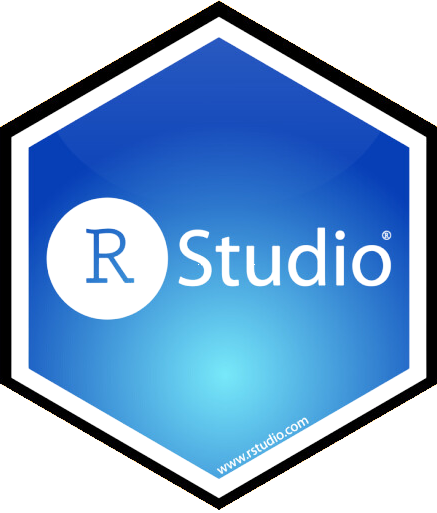
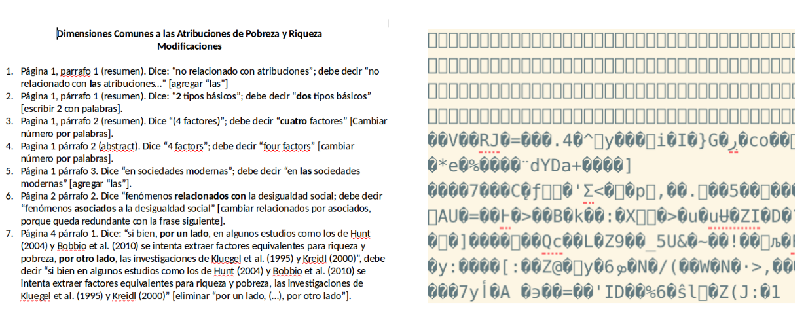
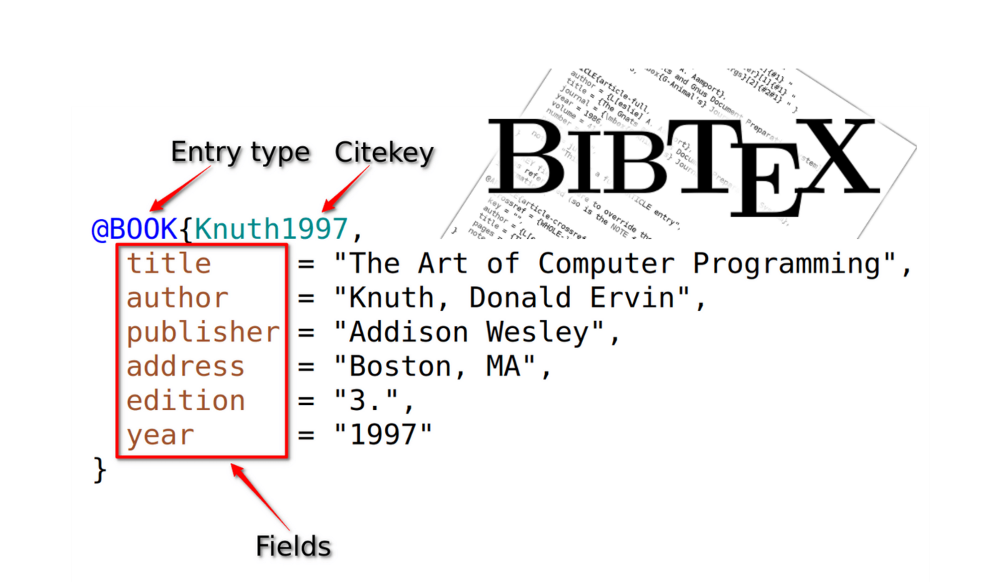
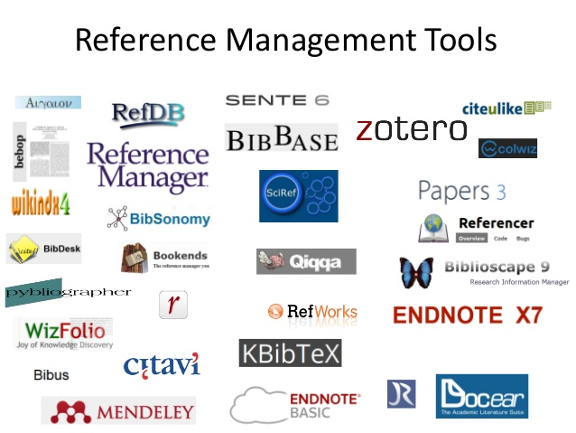
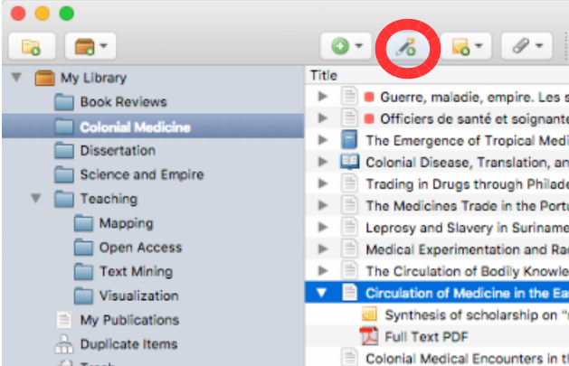
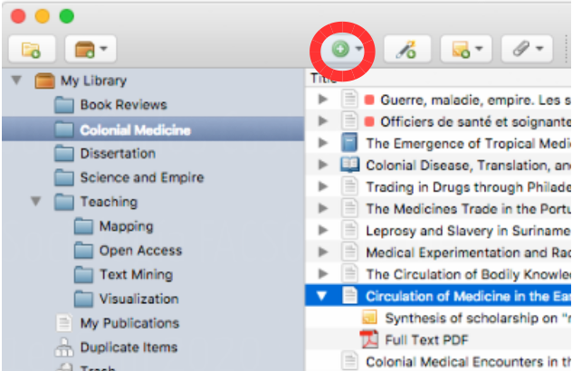
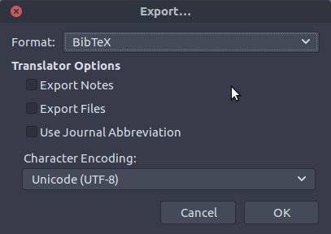

##  {data-background-color="black"}

::: {.columns .v-center-container}
::: {.column width="20%"}
{width="100%" fig-align="center"}
:::

::: {.column width="80%"}
::: rojo
### R para el análisis de datos
**Sesión 3**: Citando en texto plano
:::

------------------------------------------------------------------------

### **Kevin Carrasco**
### Sociología - UAH
### 1er Sem 2026 
### [R-data-analisis.netlify.com](https://R-data-analisis.netlify.com)
:::
:::

# Investigación reproducible {data-background-color="black"}

## Reproducibilidad

::: {.incremental}


- Es la posibilidad de **regenerar** de manera independiente los resultados usando los materiales originales de una investigación ya publicada.

- En términos simples: obtener los mismos resultados de una investigación utilizando los mismos datos.

:::

# Flujos de investigación reproducible {data-background-color="black"}

- Texto plano
- Carpetas y archivos
- Autocontenido
- Abierto

## Ejemplo con procesador de texto tradicional


## Ejemplo con procesador de texto tradicional



# Propuesta: escritura libre y abierta

## Introducción a R y RStudio

::: {.columns}
::: {.column width="50%"}
{.nostretch fig-align="center" width="300px"}


:::
::: {.column width="50%"}
{.nostretch fig-align="center" width="1000px"}

::: 
:::

## ¿Por qué usar R?

- Gratis: No es necesario pagar licencias

- Multiplataforma (Windows, Mac-OS, Linux): Los códigos de análisis pueden ser usados en distintas plataformas

- Investigación reproducible: Permite documentar los resultados obtenidos paso a paso, mostrando el flujo completo de procesamiento de los datos por medio de **scripts**

- **Integración con otros softwares**

#  Documentos en Quarto


## ¿Qué es markdown?

- Forma de escritura simple con pocas marcas de formato

- Conversión a distintos formatos de salida (html, pdf)

- Soporta encabezados, tablas, imágenes, tablas de contenidos, ecuaciones, links...

- Filosofía: foco en contenido primero, el formato después.

## ¿Qué es Quarto?

- [Quarto](https://quarto.org/) es un sistema moderno de creación de documentos dinámicos, informes, presentaciones, libros, sitios web y más, a partir de archivos de texto plano y por medio del conversor universal de documentos [Pandoc](https://pandoc.org/).

- Evolución de los sistemas de autoría como Jupyter, R Markdown, todo dentro del mismo documento. 


## Características principales

- Lenguaje que combina código (R) y texto (Markdown): Al igual que RMarkdown (.Rmd), Quarto permite combinar texto plano markdown y código de análisis R.

- Provee una serie de herramientas para generar documentos dinámicos y publicarlos


## Extensiones

- Integración con R
- Referencias bibliográficas
- Renderizado a pdf, word
- Sitios web
- Presentaciones

## Recursos

- Recursos para seguir aprendiendo:
- [https://quarto.org](https://quarto.org)
- [Creación de documentos científicos con Quarto](https://aprendeconalf.es/quarto-textos-cientificos/)
- [Tutorial Quarto for academics](https://youtu.be/EbAAmrB0luA)


# Protocolo de flujo de investigación reproducible {data-background-color="black"}

## Alternativas

::: {.columns}
::: {.column width="45%"}
::: {.fragment .fade-up}

 A. ad-hoc
 
  - cada investigador define numero de archivos, nombres, carpetas y organización
  
  - explicar al resto cómo se organiza
  - documentar en un archivo cómo se organiza
  - --> reproducibilidad y transparencia **LIMITADA**

:::
:::

::: {.column width="5%"}
:::

::: {.column width="45%"}
::: {.fragment .fade-up}

B. *Protocolo* reproducible

  - **estructura** de carpetas y archivos interconectados que refieren a reglas conocidas (estándares)
  
  - **autocontenido**: toda la información necesaria para la reproducibilidad se encuentra en la carpeta raíz o directorio de trabajo.
  
:::
:::
:::


## Propuesta: **Protocolo IPO**


## Estructura IPO


## Mayores detalles y plantilla de carpetas:


- [https://lisacoes.com/ipo-repro/](https://lisacoes.com/ipo-repro/)

- [https://github.com/lisa-coes/ipo](https://github.com/lisa-coes/ipo)

## Carpeta autocontenida

- proyecto **autocontenido**: reproducible sin necesidad de archivos externos

- requisito: establecer **directorio de trabajo**

  - posición de referencia de todas las operaciones al interior del proyecto
  
  - también llamado **directorio raíz**
  
## Directorio de trabajo

- ej. forma tradicional en hoja de código R: 

  - `setwd(ruta-a-carpeta-de-proyecto)`

  - problemas: hace referencia a ruta local en el computador donde se está trabajando, por lo tanto no es reproducible y **se debe evitar**
  
- alternativa sugerida en R: **RStudio Projects**  

## RStudio Projects

- La funcionalidad **Projects** de RStudio permite establecer claramente un directorio de trabajo de manera eficiente

- Para ello, genera un archivo de extensión **.Rproj** en el directorio raiz de la carpeta del proyecto

- Luego se facilita acceder a la carpeta del proyecto en RStudio ejecutando desde el administrador de archivos del computador (file manager) el archivo **.Rproj** 

- para comprobar, ejecutar `getwd()` y debería dar la ruta hacia la carpeta del proyecto

# Repositorios y apertura {data-background-color="black"}

## Git

::: {.columns}
::: {.column width="40%"}

:::

::: {.column width="60%"}
- es una especie de memoria o registro local que guarda información sobre:

  - quién hizo un cambio
  - cuándo lo hizo
  - qué hizo

- mantiene la información de todos los cambios en la historia de la carpeta / repositorio local

- se puede sincronizar con un repositorio remoto (ej. Github)
:::
:::

## Git/github

- actualmente, Git / Github posee más de 100 millones de repositorios

- mayor fuente de código en el mundo

- ha transitado desde el mundo de desarrollo de software hacia distintos ámbitos de trabajo colaborativo y abierto

- entorno de trabajo que favorece la ciencia abierta


## {data-background-color="black"}

### [Git no es un registro de versiones de archivos específicos, sino de una carpeta completa]{.red}

### [Guarda *"fotos"* de momentos específicos de la carpeta, y esta foto se *saca* mediante un]{.red} **commit**

##


## Commits

- El **commit** es el procedimiento fundamental del control de versiones

- Git no registra cualquier cambio que se "guarda", sino los que se "comprometen" (commit).

- En un **commit**
  - se seleccionan los archivos cuyo cambio se desea registrar (*stage*)
  - se registra lo que se está comprometiendo en el cambio (mensaje de commit)

## ¿Cuándo hacer un commit?

- según conveniencia

- sugerencias:

  - que sea un momento que requiera registro (momento de foto)
  
  - no para cambios menores
  
  - no esperar muchos cambios distintos que puedan hacer perder el sentido del commit

# Citas reproducibles {data-background-color="black"}

## ¿Cómo trabajar con citas cuando se escribe en texto plano?

3 cosas a considerar:

 1. Almacenamiento de referencias: Bibtex

 2. Generación de archivo de referencias: Zotero / BetterBibTex

 3. Citando en texto plano (markdown, Rmarkdown, Quarto y csl)

## 1. Almacenamiento de referencias

::::::: v-center-container
:::::: columns
::: {.column width="30%"}

:::

::: {.column width="10%"}
:::

::: {.column width="50%"}
-   formato de almacenamiento de citas en texto plano (no es un programa)

-   Un archivo Bibtex tiene extensión **.bib**, donde deben estar almacenadas todas las referencias citadas en el texto
:::
::::::
:::::::

## Ejemplo referencia en Bibtex



## Archivo Bibtex (.bib)

-   un archivo bibtex tiene múltiples referencias una después de la otra, el orden no es relevante.

-   lo central en cada referencia es la llave de referencia o **citation key**, que está al principio e identifica cada referencia

-   cada referencia posee una serie de campos con información necesaria para poder citar

-   este formato se puede ingresar manualmente, copiar y pegar de otras fuentes, o automatizar desde software de gestión de referencias (detalles más adelante)

## 2. Generación de archivo de referencias

### Utilizando Bibtex en escritura en texto simple

-   es claro que tanto la generación manual de registros Bibtex como la incorporación manual de citas es un gran desincentivo a su uso.

-   la simplificación y automatización de esto pasa por dos procesos:

    -   Automatizar la **generación** de un archivo .bib desde un software de gestión de referencias (Zotero - BetterBibTex)

    -   Automatizar la **incorporación** de citas al documento

## 

{width="80%" fig-align="center"}

## Software de gestión de referencias

-   los software de gestión de referencias bibliográficas permiten almacenar, organizar y luego utilizar las referencias

-   diferentes alternativas de software de gestión de referencias bibliográficas: Endnote, Mendeley, Refworks, Zotero

-   en adelante vamos a ejemplificar con **Zotero**, que es un software libre y de código abierto

## 

::: {.slarge .v-center-container .red}
Vamos a usar Zotero para guardar y organizar nuestras referencias bibliográficas, y como *bot* para generar un archivo .bib
:::

## Zotero

::::::: v-center-container
:::::: columns
::: {.column width="30%"}
{fig-align="center"}
:::

::: {.column width="10%"}
:::

::: {.column width="50%"}
-   instalar [https://www.zotero.org](zotero.org)

-   además del programa, es recomendable que es sus computadores personales puedan instalar "conector" para el navegador ( extensión que permite almacenar directamente con 1 click)
:::
::::::
:::::::

## Zotero: vista general

### 

## Almacenamiento 1: vía conector navegador

Cuando hay una referencia presente en la página, ir al botón del conector y se guarda (Zotero debe estar abierto)

(la referencia se almacena en la carpeta que está activa en Zotero, se puede cambiar al momento de guardar)


## Almacenamiento 2: vía identificador DOI / ISBN / ISSN \]

\]

## Almacenamiento 3: manual

Llenando los campos uno por uno:



## 

::: {.slarge .highlight-container-red .v-center-container}
Al almacenar fijarse que los campos necesarios están completos y que los nombres de los mismos autores coinciden entre citas
:::

## Zotero

-   más información sobre manejo y capacidades:

<https://www.youtube.com/watch?v=Uxv3aE4XoNY>

... y tutoriales y guías varios en la red

## Zotero-Bibtex

-   Zotero permite exportar las referencias en formato Bibtex

-   Puede ser toda la colección o una parte (carpeta)

-   2 alternativas:

    -   manual
    -   automatizada

## Zotero-Bibtex: exportación manual

<br>



-   Carpeta -\> boton derecho -\> export -\> formato Bibtex

-   guardar archivo .bib en carpeta del proyecto


## Zotero- Bibtex: Exportando referencias

-   puede ser colección completa o carpetas específicas

-   posicionarse sobre carpeta, botón derecho y `Export collection`

    ```         
    - Formato: BibTex
    - dar ruta hacia carpeta del proyecto
    ```

-   precaución: no caracteres especiales ni espacios en el nombre del archivo .bib


# 3. Citando en texto plano

## Para citar en texto plano:

a.  Agregar el archivo .bib al preámbulo del documento (YAML)
b.  Agregar archivo de formato de bibliografía (csl)
c.  Insertar citas

## bib y csl en YAML


    ```
    ---
    title: "My document"
    bibliography: input/bib/merit-factorial.bib
    csl: "input/bib/apa6.csl"
    ---

     Y aquí comienza el documento ...
    ```


## Sobre .csl

-   además de las referencias en .bib, necesitamos poder dar el estilo de formato deseado a citas y bibliografía, mediante archivos **csl** (citation style language)

-   existen múltiples estilos de citación (alrededor de 10.000)

-   los más usados: APA, ASA, Chicago

-   estos estilos (en archivos csl) se pueden bajar desde repositorios, se recomienda el siguiente: <https://www.zotero.org/styles>

## Citando

La forma de citar es a través de la .red[clave que identifica la referencia], que es la que aparece al principio de cada una, y se agrega una \@. Ej:

::: {.slarge}
```         
- Tal como señala @sabbagh_dimension_2003, los principales resultados ...
```
:::

Al renderizar, esto genera:

-   **Tal como señala Sabbagh (2003), los principales resultados ...**

Y además, agrega la bibliografía al final del documento.

## Opciones de citación

<br>

| Se escribe | Renderiza |
|----|----|
| `Como dice @sabbagh_dimension_2003` | Como dice Sabbagh (2003) |
| `Evidencia señala [@sabbagh_dimension_2003]` | Evidencia señala (Sabbagh, 2020) |
| `Sabbagh [@sabbagh_dimension_2003, pp.35] dice ...` | Sabbagh (2020, p.35) dice ... |

-   Más de una cita: separadas por **;**

## Citando en documentos Markdown/Quarto en R

Diferentes formas, pero lo más fácil:

-   visual mode
-   presionar \@ y se despliegan las referencias del .bib
-   insert -> citations

# Tutorial de Zotero {data-background-color="black"}
[https://r-data-analisis.netlify.app/practicos/02-content-zotero](https://r-data-analisis.netlify.app/practicos/02-content-zotero)


##  {data-background-color="black"}

::: {.columns .v-center-container}
::: {.column width="20%"}
{width="80%" fig-align="right"}
:::

::: {.column width="80%"}
::: rojo
R para el análisis de datos
:::

------------------------------------------------------------------------

### **Kevin Carrasco**
### Sociología - UAH
### 1er Sem 2026
### [R-data-analisis.netlify.com](https://R-data-analisis.netlify.com)
:::
:::
