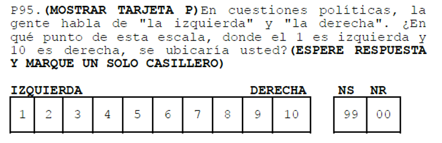
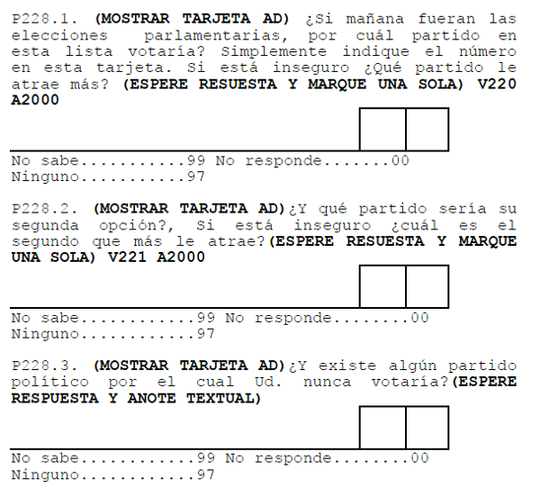
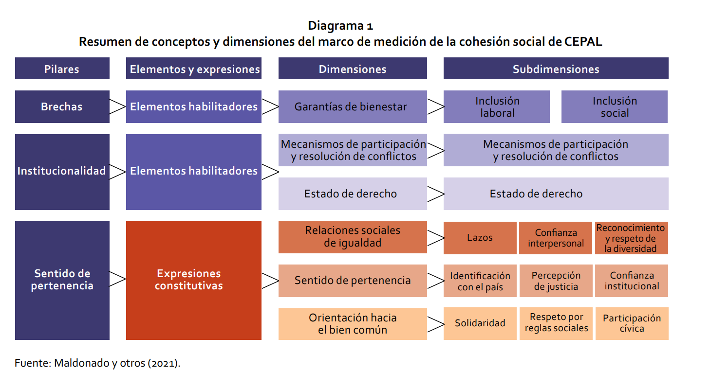
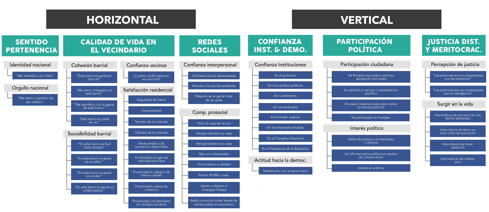

##  {data-background-color="black"}

::: {.columns .v-center-container}
::: {.column width="20%"}
{width="100%" fig-align="center"}
:::

::: {.column width="80%"}
::: rojo
### R para el análisis de datos
**Sesión 4**: Planteando una investigación cuantitativa
:::

------------------------------------------------------------------------

### **Kevin Carrasco**
### Sociología - UAH
### 1er Sem 2026 
### [R-data-analisis.netlify.com](https://R-data-analisis.netlify.com)
:::
:::

# Introducción y bases de la investigación cuantitativa

## Introducción y bases de la investigación cuantitativa

::: {.incremental}
- En la investigación cuantitativa se asume que hay una realidad "allá afuera" que quien investiga puede conocer a través de su **cuantificación**

- Permite lidiar con la **incertidumbre**

- Foco en la teoría (*generalmente* método **hipotético-deductivo**)
:::

## Introducción y bases de la investigación cuantitativa

::: {.incremental}

- Explicar lo que es, no lo que debería ser  

- Conocer y explicar grupos, no individuos
:::

## Proceso de investigación cuantitativo (D'Ancona 2001)

1. Formulación del problema  
2. Diseño  
   - Hipótesis

   ::: {.fragment}
   - Operacionalización de conceptos
   :::

   - Unidad de análisis  
3. Metodología
4. Factibilidad  

# Medición y operacionalización

## Medición y operacionalización

::: {.incremental}

- Operacionalización = **codificación** para hacer medible  

- Múltiples formas de medir un concepto  

- Importancia de definir conceptos  

:::

## Medición y operacionalización

::: {.center}
¿Qué concepto se mide?
:::

{width=95%}

## Medición y operacionalización

::: {.center}
¿Y con estas preguntas?
:::

{width=80%}

## Medición y operacionalización

::: {.center}
¿Conceptos complejos?
:::

::: {.fragment}
::: {.center}
¿Cómo medir cohesión social?
:::
:::

## Medición y operacionalización

- Cohesión social (CEPAL, 2021)

{width=75%}

## Medición y operacionalización

- Cohesión social (OCS-COES, 2020)

{width=75%}

## Diseños de investigación

- Transversal  
- Longitudinal  
- Experimental  

## Diseño transversal

{width=75%}

## Diseño longitudinal

{width=64%}

## Diseño experimental

{width=53%}

## [Datos]{.yellow} y variables

- Los datos miden una característica de una unidad en un tiempo  

::: {.fragment}
- Ejemplo: esperanza de vida en Chile (2017)  

  - Variable: esperanza de vida  
  - Unidad: años  
  - Tiempo: 2017  
:::

## [Datos]{.yellow} y variables

- Base de datos  

{width=60%}

## [Datos]{.yellow} y variables

- fila = caso  
- columna = variable  
- variable = valores numéricos  
- valores pueden tener etiquetas  

## [Datos]{.yellow} y variables

### Ejemplos

1. CEP  
2. CASEN  
3. Latinobarómetro  
4. ELSOC  
5. MINEDUC  

## Datos y [variables]{.yellow}

- Una variable = algo que varía  

- $Variable \neq Constante$

---

## Datos y [variables]{.yellow}

- Discretas  
  - Dicotómicas  
  - Politómicas  

- Continuas  

---

## Escalas de medición

- NOIR

| Tipo | Características | Propiedad | Ejemplo |
|------|----------------|----------|--------|
| Nominal | Categorías | Identidad | Nacionalidad |
| Ordinal | Orden | Ranking | Educación |
| Intervalar | Intervalos iguales | Igualdad | Temperatura |
| Razón | Cero real | Aditividad | Distancia |

## Medidas de tendencia central

- **Moda**  

- **Mediana**  

- **Media**  

## Medidas de tendencia central

- Dispersión

  - **Varianza** 
  - **Desviación estándar**

## Más información

[Moore: Comprensión de los datos](https://multivariada.netlify.app/docs/lecturas/moore_comprensiondelosdatos.pdf)

# Trabajo 1

## Estructura de carpetas

## Repositorio

## GitHub Pages

## Protocolo reproducible

{width=40%}

##  {data-background-color="black"}

::: {.columns .v-center-container}
::: {.column width="20%"}
{width="80%" fig-align="right"}
:::

::: {.column width="80%"}
::: rojo
R para el análisis de datos
:::

------------------------------------------------------------------------

### **Kevin Carrasco**
### Sociología - UAH
### 1er Sem 2026
### [R-data-analisis.netlify.com](https://R-data-analisis.netlify.com)
:::
:::
