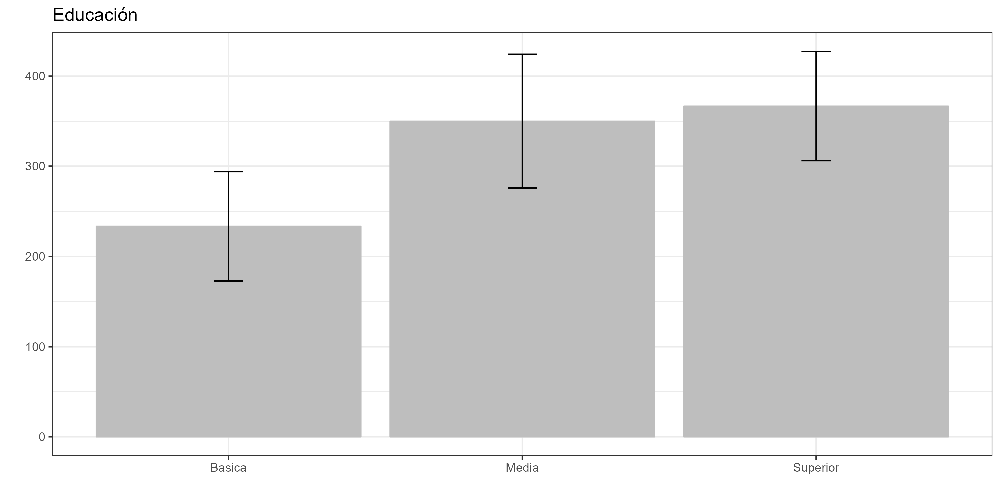
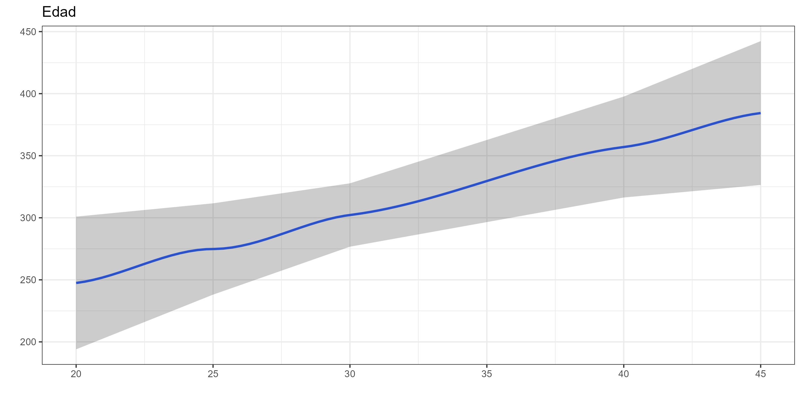

```{r}
#| label: setup
#| include: false
require("knitr")
options(htmltools.dir.version = FALSE)
pacman::p_load(
  RefManageR, flipbookr, tidyverse, broom, sjPlot, sjmisc,
  kableExtra, ggplot2, dplyr, purrr, modelsummary
)
knitr::opts_chunk$set(
  warning = FALSE,
  message = FALSE,
  echo = FALSE,
  cache = FALSE
)
```

##  {data-background-color="black"}

::: {.columns .v-center-container}
::: {.column width="20%"}
{width="100%" fig-align="center"}
:::

::: {.column width="80%"}
::: rojo
### R para el análisis de datos
**Sesión 8**: Regresión lineal
:::

------------------------------------------------------------------------

### **Kevin Carrasco**
### Sociología - UAH
### 1er Sem 2026 
### [R-data-analisis.netlify.com](https://R-data-analisis.netlify.com)
:::
:::

---

## {.inverse .bottom .right data-background-color="black"}

### Sesión 8
<br>

Regresión lineal

R2

Inferencia

Valores predichos

<br>
<br>

---

## {.inverse .bottom .right data-background-color="black"}

### Sesión 8
<br>

**Regresión lineal**

R2

Inferencia

Valores predichos

<br>
<br>

---

### Asociación: covarianza / correlación

::: {.pull-left}
  _¿Se relaciona la variación de una variable, con la variación de otra variable?_
:::
::: {.pull-right}
::: {.center}
{width=100%}
:::
:::

---

### Correlación

- Medida de co-variación lineal estandarizada

::: {.fragment}
::: {.center}
¿En qué rango varía una correlación?
:::
:::

::: {.fragment}
- Varía entre -1 y +1
:::

::: {.fragment}
- Gráficamente se expresa en *nubes de puntos*
:::

---

::: {.center}
{width=80%}
:::

---

::: {.pull-left}
* Pero ojo, **correlación no implica causalidad**
:::


::: {.pull-right}
{width=100%}
:::

---

### ¿Qué es la regresión lineal?

::: {.fragment}

* Es un modelo estadístico

:::
::: {.fragment}

- Se usa para:

  - **Conocer**: La relación de una variable dependiente de acuerdo a una/otras independiente(s)
  - **Predecir**: Estimar el valor de una variable dependiente de acuerdo al valor de otras
  - **Inferir**: si estas relaciones son estadísticamente significativas
:::

---

### ¿Qué es la regresión lineal?

* Dos tipos de regresión:
  - Regresión lineal simple (una variable independiente)
  - Regresión lineal múltimple (más de una variable independiente)

---

### ¿Qué es la regresión lineal

::: {.pull-left-narrow}
### Terminología:
:::

::: {.pull-right-wide}
{width=100%}
:::

---

```{r echo=FALSE}
data <- cbind(Educacion=c(1,2,3,4,5,6,7,8),
              Ingreso=c(250,200,250,300,400,350,400,350))
data <- as.data.frame(data)
```


### Ejemplo 


```{r}
data
```

---

### Ejemplo 


```{r echo=FALSE}
plot1<- ggplot2::ggplot(data, aes(x=Educacion, y=Ingreso))+
  geom_point(size=3)+
  scale_x_continuous(breaks = seq(0, 8, by = 1)) +
  scale_y_continuous(breaks = seq(0, 700, by = 100))+
  ylim(0,700)+
  xlim(0,8)

ggsave(plot1, file="../../files/img/plot1.png")
```


{width=100%}


---

### Ejemplo 


```{r warning=FALSE, message=FALSE}
plot2<- ggplot2::ggplot(data, aes(x=Educacion, y=Ingreso))+
  geom_point(size=3)+
  geom_smooth(method = "lm", se=FALSE)+
  scale_x_continuous(breaks = seq(0, 8, by = 1)) +
  scale_y_continuous(breaks = seq(0, 700, by = 100))+
  ylim(0,700)+
  xlim(0,8)

ggsave(plot2, file="../../files/img/plot2.png")
```

{width=100%}


---


### La recta de regresión


$$\widehat{Y}=b_{0} +b_{1}X$$

Donde

- $\widehat{Y}$ es el valor estimado de $Y$

- $b_{0}$ es el intercepto de la recta (el valor de Y cuando X es 0)

- $b_{1}$ es el coeficiente de regresión, que nos dice cuánto aumenta Y por cada punto que aumenta X


---

### Estimación de los coeficientes de la ecuación:

$$b_{1}=\frac{Cov(XY)}{VarX}$$

$$b_{1}=\frac{\frac{\sum_{i=1}^{n}(x_i - \bar{x})(y_i - \bar{y})} {n-1}}{\frac{\sum_{i=1}^{n}(x_i - \bar{x})(x_i - \bar{x})} {n-1}}$$

Y simplificando

$$b_{1}=\frac{\sum_{i=1}^{n}(x_i - \bar{x})(y_i - \bar{y})} {\sum_{i=1}^{n}(x_i - \bar{x})(x_i - \bar{x})}$$

---

### Pero este es un curso de R, así que:

```{r}
reg1<-lm(Ingreso~Educacion, data=data)
reg1
```

---

### Estimación de los coeficientes de la ecuación:

$$\bar{Y}=b_{0}+b_{1}\bar{X}$$
Reemplazando:

$$\bar{Y}=b_{0}+25\bar{X}$$

Despejando el valor de $b_{0}$

$$b_{0}=200-0\bar{X}$$

---

### Ejemplo 


*Por cada unidad que aumenta educación, ingreso aumenta en 25 unidades*


```{r warning=FALSE, message=FALSE}
ggplot2::ggplot(data, aes(x=Educacion, y=Ingreso))+
  geom_point(size=3)+
  geom_smooth(method = "lm", se=FALSE)+
  scale_x_continuous(breaks = seq(0, 8, by = 1)) +
  scale_y_continuous(breaks = seq(0, 700, by = 100))+
  ylim(0,700)+
  xlim(0,8)
```


{width=100%}


---

## {.inverse .bottom .right data-background-color="black"}

### Sesión 8
<br>

Regresión lineal

**R2**

Inferencia

Valores predichos

<br>
<br>
<br>
<br>

---

## Varianza explicada

- ¿Qué porcentaje de la varianza de Y logramos explicar con X?

::: {.fragment}

* **R2** = Porcentaje de la variación de Y puede ser asociado a la variación de X
:::

---

### Ejemplo 


El ajuste del modelo a los datos se relaciona con la proporción de residuos generados por el modelo respecto de la varianza total de Y (R2)

```{r warning=FALSE, message=FALSE}
ggplot2::ggplot(data, aes(x=Educacion, y=Ingreso))+
  geom_point(size=3)+
  geom_smooth(method = "lm", se=FALSE)+
  scale_x_continuous(breaks = seq(0, 8, by = 1)) +
  scale_y_continuous(breaks = seq(0, 700, by = 100))+
  ylim(0,700)+
  xlim(0,8)
```


{width=100%}


---

## {.inverse .bottom .right data-background-color="black"}

### Sesión 8
<br>

Repaso sesión anterior

Regresión lineal

R2

**Inferencia**

Valores predichos

<br>
<br>
<br>
<br>

---

## Inferencia estadística

* ¿Cómo sabemos si $b_{1}$ es estadísticamente significativo?

::: {.fragment}

* ¿Nuestros datos se pueden extrapolar a la población?
:::

---

## Inferencia estadística

- Según criterios muestrales:
  * Distribución normal
  * Desviación estándar
  
- Error estándar

---

```{r results='asis'}
texreg::htmlreg(reg1, caption="")
```

---

```{r echo=FALSE}
data <- as.data.frame(cbind(data,
              edad=c(25,20,20,30,45,30,45,40)))
```


```{r results='asis'}
reg2 <- lm(Ingreso~Educacion+edad, data = data)
texreg::htmlreg(reg2, caption="")
```

---

### Parcialización

::: {.center}
{width=50%}
:::


```{r echo=FALSE}
data <- as.data.frame(cbind(data,
              Educacion_rec=c("Basica","Basica","Basica","Media","Media","Superior","Superior","Superior")))
reg3 <-lm(Ingreso~Educacion_rec, data=data)
```

---

### ¿y la interpretación para variables categóricas?


```{r results='asis'}
texreg::htmlreg(reg3, caption="",
                custom.coef.names = c("Intercepto",
                                     "Educación media",
                                     "Educación superior"))
```


::: {.fragment}

*Las personas que tienen educación media ganan $116mil más en comparación con quienes tienen educación básica, efecto que es estadísticamente significativo (p<0.01)*

:::

---

## {.inverse .bottom .right data-background-color="black"}

### Sesión 8
<br>

Repaso sesión anterior

Regresión lineal

R2

Inferencia

**Valores predichos**

<br>
<br>
<br>
<br>

---

### ¿Cómo podemos predecir el valor esperado de una variable para una persona en particular?


```{r results='asis'}
texreg::htmlreg(reg3, caption="",
                custom.coef.names = c("Intercepto",
                                     "Educación media",
                                     "Educación superior"))
```

---

$$\bar{Y}=b_{0}+b_{1}\bar{X}$$

Reemplazando:

$$\bar{Y}=233+b_{1}\bar{X}$$

¿Si una persona tuviera un nivel de educación superior?

$$\bar{Y}=233+133$$
$$\bar{Y}=366$$

---


## Graficando

```{r}
plot3 <- ggeffects::ggpredict(reg3, terms = c("Educacion_rec")) %>%
  ggplot(aes(x=x, y=predicted)) +
  geom_bar(stat="identity", color="grey", fill="grey")+
  geom_errorbar(aes(ymin = conf.low, ymax = conf.high), width=.1) +
  labs(title="Educación", x = "", y = "") +
  theme_bw()

ggsave(plot3, file="../../files/img/plot3.png")

```


{width=85%}

---

### Variables numéricas

```{r results='asis'}
reg4 <- lm(Ingreso~edad, data = data)
texreg::htmlreg(reg4, caption="")
```

---


```{r}
plot4 <- ggeffects::ggpredict(reg2, terms="edad") %>%
  ggplot(mapping=aes(x = x, y=predicted)) +
  labs(title="Edad", x = "", y = "")+
  theme_bw() +
  geom_smooth()+
  geom_ribbon(aes(ymin = conf.low, ymax = conf.high), alpha = .2, fill = "black")

ggsave(plot4, file="../../files/img/plot4.png")
```

{width=100%}


$$\bar{Y}=b_{0}+b_{1}\bar{X}$$

Reemplazando:

$$\bar{Y}=96.44+b_{1}*6,78$$

¿Una persona de edad 40?

$$\bar{Y}=96,44+40*6,78$$
$$\bar{Y}=367.64$$


##  {data-background-color="black"}

::: {.columns .v-center-container}
::: {.column width="20%"}
{width="100%" fig-align="center"}
:::

::: {.column width="80%"}
::: rojo
### R para el análisis de datos
**Sesión 8**: Regresión lineal
:::

------------------------------------------------------------------------

### **Kevin Carrasco**
### Sociología - UAH
### 1er Sem 2026 
### [R-data-analisis.netlify.com](https://R-data-analisis.netlify.com)
:::
:::