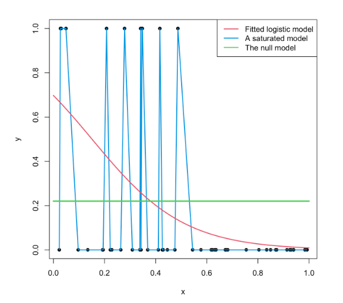

```{r}
#| label: setup
#| include: false
require("knitr")
options(htmltools.dir.version = FALSE)
pacman::p_load(RefManageR, flipbookr, tidyverse,
               sjmisc, descr, scales, xtable, ggmosaic,
               stargazer, summarytools, sjPlot, dplyr)
knitr::opts_chunk$set(
  warning = FALSE,
  message = FALSE,
  echo = FALSE,
  cache = FALSE,
  fig.width = 7,
  fig.height = 5.2
)
```

##  {data-background-color="black"}

::: {.columns .v-center-container}
::: {.column width="40%"}
# Métodos estadísticos para Ciencias Sociales III
### **Kevin Carrasco**
### Sociología - UNAB
### 2do semestre 2025
### [metod3-unab.netlify.app](metod3-unab.netlify.app)
:::

::: {.column width="60%"}
::: {style="text-align: right;"}
<br>

## Sesión 9: Regresión logística (2)

{width="70%" fig-align="right"}
:::
:::
:::

---

## {.inverse .bottom .right data-background-color="black"}

### Contenidos

**1. Repaso de sesión anterior**

**2. Estimación regresión logística**

**3. Ajuste regresión logística**

---

## {.inverse .bottom .right data-background-color="black"}

# 1. Repaso sesión anterior

---

## Variables

- discretas (Rango finito de valores):

  - Dicotómicas
  - Politómicas

- continuas:

  - Rango (teóricamente) infinito de valores.

---

## Tipos de análisis estadístico bivariado

- Variable dependiente (y): lo que quiero explicar

- Variable independiente (x): lo que me permite explicar la dependiente

| Variable independiente x | Variable dependiente Categórica | Variable dependiente Continua |
|---|---|---|
| Categórica | Análisis de tabla de Contingencia, Chi2 | Análisis de Varianza ANOVA, Prueba T |
| Continua | Regresión Logística | Correlación / Regresión Lineal |

---

## {.inverse .center .middle data-background-color="black"}

:::: {.columns}
::: {.column width="40%"}
{width="80%"}
:::
::: {.column width="60%"}
## ¿Se puede anticipar el final?
:::
::::

---

## Titanic data

```{r}
#| echo: false
pacman::p_load(sjmisc, descr, scales, xtable, ggmosaic, stargazer, summarytools, sjPlot, dplyr)
load("titanic.Rdata")
```

```{r}
#| echo: false
tt2 <- tt %>% select(survived, sex, age)
print(dfSummary(tt2, headings = FALSE), method = "render")
```

---

## Sobrevivientes & Sexo

```{r}
#| echo: false
plot1 <- ggplot(tt, aes(survived, fill = survived)) + 
  geom_bar() + 
  geom_text(
    aes(label = scales::percent((..count..)/sum(..count..))),
    stat = 'count', size = 10, vjust = 3) + 
  theme(legend.position = "none", 
        text = element_text(size = 30),
        axis.title = element_blank())
```

:::: {.columns}
::: {.column width="50%"}
```{r}
#| echo: false
#| fig-height: 6
plot1
```
:::
::: {.column width="50%"}
```{r}
#| echo: false
#| fig-height: 6
(ggplot(tt, aes(sex, fill = sex))
 + geom_bar()
 + geom_text(
     aes(label = scales::percent((..count..)/sum(..count..))),
     stat = 'count',
     size = 10,
     vjust = 3)
 + theme(legend.position = "none", text = element_text(size = 30), axis.title = element_blank())
)
```
:::
::::

---

## Sobrevivencia / sexo

::: {.center}
{width="55%"}
:::

---

## Limitaciones modelo de regresión lineal para dependientes dicotómicas (= modelo de probabilidad lineal)

:::: {.columns}
::: {.column width="50%"}
```{r}
#| echo: false
#| results: hide
str(tt$survived)
tt <- tt %>% mutate(survived_n = recode(survived,
  "No sobrevive" = 0, "Sobrevive" = 1))
str(tt$survived_n)
```

```{r}
#| echo: false
#| fig-height: 6
ggplot(data = tt, aes(x = as.numeric(sex), y = survived_n)) +
  geom_point(aes(color = as.factor(survived_n)), shape = 1) +
  geom_smooth(method = "lm", color = "gray20", se = FALSE) +
  theme_bw()  +
  labs(title = "Regresión lineal por mínimos cuadrados",
       y = "Sobrevive") +
  theme(legend.position = "none", text = element_text(size = 20))
```
:::
::: {.column width="50%"}
```{r}
#| echo: false
tt$survived_n2 <- tt$survived_n
tt$survived_n2[tt$age > 40] <- 0
tt$survived_n2[tt$age < 20] <- 1
```

```{r}
#| echo: false
#| fig-height: 6
ggplot(data = tt, aes(x = age, y = survived_n2)) +
  geom_point(aes(color = as.factor(survived_n2)), shape = 1) +
  geom_smooth(method = "lm", color = "gray20", se = FALSE) +
  theme_bw()  +
  labs(title = "Regresión lineal por mínimos cuadrados",
       y = "Sobrevive") +
  theme(legend.position = "none", text = element_text(size = 20))
```
:::
::::

---

## {.inverse .bottom .right data-background-color="black"}

La **regresión logística** ofrece una solución a los problemas del **rango** de predicciones y de **ajuste** a los datos del modelo de probabilidad lineal

::: {.fragment}
## Se logra mediante:
### (a) expresión de coeficientes como odds-ratio
### (b) *transformación* de los coeficientes a **LOGIT**
:::

---

## Curvando la recta ...

:::: {.columns}
::: {.column width="50%"}
```{r}
#| echo: false
ggplot(data = tt, aes(x = age, y = survived_n2)) +
  geom_point(aes(color = as.factor(survived_n2)), shape = 1) +
  geom_smooth(method = "lm", color = "gray20", se = FALSE) +
  theme_bw()  +
  labs(title = "Regresión lineal por mínimos cuadrados",
       y = "Sobrevive") +
  theme(legend.position = "none", text = element_text(size = 20))
```
:::
::: {.column width="50%"}
```{r}
#| echo: false
modelo_logistico2 <- glm(survived_n2 ~ age, data = tt, family = "binomial")
```

```{r}
#| echo: false
ggplot(data = tt, aes(x = age, y = survived_n2)) +
  geom_point(aes(color = as.factor(survived_n2)), shape = 1) +
  stat_function(fun = function(x){predict(modelo_logistico2,
                                          newdata = data.frame(age = x),
                                          type = "response")}) +
  theme_bw() +
  labs(title = "Regresión logística",
       y = "Probabilidad sobrevivir") +
  theme(legend.position = "none", text = element_text(size = 20))
```
:::
::::

---

## Odds

- **odds** (chances): probabilidad de que algo ocurra dividido por la probabilidad de que no ocurra

$$Odds=\frac{p}{1-p}$$

::: {.fragment}
Ej. Titanic:

- 427 sobrevivientes (41%), 619 muertos (59%)

$$Odds_{sobrevivir}=427/619=0.41/0.59=0.69$$

**Es decir, las chances de sobrevivir son de 0.69**
:::

---

## Odds ratio (OR)

:::: {.columns}
::: {.column width="50%"}
- los odds-ratio (o razón de chances) permiten reflejar la asociación entre las chances de dos variables dicotómicas

**¿Tienen las mujeres más chances de sobrevivir que los hombres?**
:::
::: {.column width="50%"}
::: {.fragment}
```{r}
sjt.xtab(tt$survived, tt$sex,
        show.col.prc = TRUE,
        show.summary = FALSE)
```
:::
:::
::::

---

## Odds Ratio

**¿Cuántas más chances de sobrevivir tienen las mujeres respecto de los hombres?**

- OR supervivencia mujeres / OR supervivencia hombres

$$OR=\frac{p_{m}/(1-p_{m})}{p_{h}/(1-p_{h})}=\frac{0.753/(1-0.753)}{0.205/(1-0.205)}=\frac{3.032}{0.257}=11.78$$

::: {.fragment}
### Las chances de sobrevivir de las mujeres son **11.78** veces más que las de los hombres.
:::

---

## {.inverse .bottom .right data-background-color="black"}

# 2. Regresión logística: Estimación

---

## Regresión logística y odds

:::: {.columns}
::: {.column width="50%"}
```{r}
#| echo: false
ggplot(data = tt, aes(x = age, y = survived_n2)) +
  geom_point(aes(color = as.factor(survived_n2)), shape = 1) +
  stat_function(fun = function(x){predict(modelo_logistico2,
                                          newdata = data.frame(age = x),
                                          type = "response")}) +
  theme_bw() +
  labs(title = "Regresión logística",
       y = "Probabilidad sobrevivir") +
  theme(legend.position = "none", text = element_text(size = 20))
```
:::
::: {.column width="50%"}
Una de las transformaciones que permite realizar una estimación de regresión con variables dependientes dicotómicas es el **logit**, que es logaritmo de los odds.
:::
::::

---

## Logit

$$Logit=ln(Odd)=ln(\frac{p}{1-p})$$

---

## Probabilidades, odds y logit

:::: {.columns}
::: {.column width="50%"}
```{r}
#| echo: false
df <- data.frame(matrix(ncol = 3, nrow = 19))
x <- c("prob", "odds", "logit")
colnames(df) <- x
df[is.na(df)] = " "
df$prob <- seq(0.001, 0.999, length.out = 19)
print(df, digits = 3, row.names = FALSE)
```
:::
::: {.column width="50%"}
:::
::::

---

## Probabilidades, odds y logit

:::: {.columns}
::: {.column width="50%"}
```{r}
#| echo: true
#| eval: false
df$odds <- df$prob/(1-df$prob)
df$logit <- log(df$odds)
```
:::
::: {.column width="50%"}
```{r}
#| echo: false
df <- data.frame(matrix(ncol = 3, nrow = 19))
x <- c("prob", "odds", "logit")
colnames(df) <- x
df[is.na(df)] = " "
df$prob <- seq(0.001, 0.999, length.out = 19)
df$odds <- df$prob/(1-df$prob)
df$logit <- log(df$odds)
print(df, digits = 3, row.names = FALSE)
```
:::
::::

---

## Probabilidades, odds y logit (destacado)

:::: {.columns}
::: {.column width="50%"}
```{r}
#| echo: true
#| eval: false
df$odds <- df$prob/(1-df$prob)
df$logit <- log(df$odds)
```
:::
::: {.column width="50%"}
```{r}
#| echo: true
#| eval: false
##    prob     odds  logit
##  0.0010   0.0010 -6.907  # <
##  0.0564   0.0598 -2.816
##  0.1119   0.1260 -2.072
##  0.1673   0.2010 -1.605
##  0.2228   0.2866 -1.250
##  0.2782   0.3855 -0.953
##  0.3337   0.5008 -0.692
##  0.3891   0.6370 -0.451
##  0.4446   0.8004 -0.223
##  0.5000   1.0000  0.000  # <
##  0.5554   1.2494  0.223
##  0.6109   1.5700  0.451
##  0.6663   1.9970  0.692
##  0.7218   2.5942  0.953
##  0.7772   3.4888  1.250
##  0.8327   4.9761  1.605
##  0.8881   7.9374  2.072
##  0.9436  16.7165  2.816
##  0.9990 999.0000  6.907  # <
```
:::
::::

---

## Estimación en R: `glm`

```r
modelo <- glm(dependiente ~ indep1 + indep2 + ...,
          data = datos,
          family = "binomial")
```

- `glm` (general lineal model) es la función para variables dependientes categóricas

- `family="binomial"` indica que la dependiente es dicotómica

---

## Ejemplo Titanic

:::: {.columns}
::: {.column width="50%"}
```{r}
#| echo: true
modelo_titanic <-
glm(survived ~ sex,
data = tt,
family = "binomial")
```
:::
::: {.column width="50%"}
```{r}
#| results: asis
#| echo: false
or <- texreg::extract(modelo_titanic)
or@coef <- exp(or@coef)
or@se <- numeric()

texreg::htmlreg(list(modelo_titanic, or), doctype = FALSE, caption = " ",
                custom.coef.names = c("Intercepto", "Mujer (Ref=Hombre)"),
                custom.model.names = c("Logit", "OR"), digits = 3)
```
:::
::::

---

## Interpretación de asociaciones y contraste de hipótesis

### Coeficiente logit asociado a sexo (mujer) = +2.467:

- El log-odds de sobrevivencia aumenta para las mujeres en 2.467 en comparación con los hombres.

::: {.fragment}
### Contraste de hipótesis

- La diferencia de las probabilidades de sobrevivir entre hombres y mujeres son estadísticamente significativas, por lo que se rechaza la hipótesis nula (de ausencia de diferencias entre hombres y mujeres) con un nivel de probabilidad $p<0.001$.
:::

---

## Interpretación de coeficientes logit

- Sustantivamente no nos dice mucho, ya que el logit es una transformación de la escala original.

- Por lo tanto, para poder interpretar el sentido del coeficiente se requiere volver a la métrica de odds mediante una transformación inversa o **exponenciación**

---

## De logits a odds

:::: {.columns}
::: {.column width="50%"}
$$logit_x=log(Odds)$$
$$e^{logit}=Odds_X$$
$$e^{2.467}=11.78$$
:::
::: {.column width="50%"}
```{r}
#| echo: true
exp(2.467)
```
### Las chances (odds) de sobrevivir siendo mujer son **11.78** veces más que las de un hombre.
:::
::::

---

## De logits a odds

$$Odds_X=e^{\beta_0 + \beta_jX_j}$$

::: {.fragment}
- Predicción para **mujeres** = -1.354 + (2.467 * Sexo=1) = 1.113

- Predicción para **hombres** = -1.354 + (2.467 * Sexo=0) = -1.354
:::

::: {.fragment}
$$Odds_{mujer}=e^{1.113}=3.032$$
$$Odds_{hombre}=e^{-1.354}=0.257$$
:::

---

## Transformación a probabilidades predichas

$$p_{mujeres}=\frac{e^{1.113}}{1+e^{1.113}}=\frac{3.04}{4.04}=0.752$$
$$p_{hombres}=\frac{e^{-1.354}}{1+e^{-1.354}}=\frac{0.258}{1.258}=0.205$$

---

## Regresión logística simple para independientes continuas

:::: {.columns}
::: {.column width="50%"}
```{r}
#| echo: true
modelo_titanic_age <-
glm(survived ~ age,
data = tt,
family = "binomial")
```
:::
::: {.column width="50%"}
```{r}
#| results: asis
#| echo: false
or <- texreg::extract(modelo_titanic_age)
or@coef <- exp(or@coef)
or@se <- numeric()

texreg::htmlreg(list(modelo_titanic_age, or), doctype = FALSE, caption = " ",
                custom.coef.names = c("Intercepto", "Edad"),
                custom.model.names = c("Logit", "OR"), digits = 3)
```
:::
::::

---

## Plot probabilidades predichas

::: {.center}
```{r}
ggplot(tt, aes(x = age, y = survived_n2)) + 
  geom_point(alpha = .5) +
  stat_smooth(method = "glm", se = FALSE, method.args = list(family = binomial))
```
:::

---

## Regresión logística múltiple

:::: {.columns}
::: {.column width="50%"}
```{r}
#| echo: true
modelo_titanic2 <-
glm(survived ~ sex + age,
data = tt,
family = "binomial")
```
:::
::: {.column width="50%"}
```{r}
#| results: asis
#| echo: false
or2 <- texreg::extract(modelo_titanic2)
or2@coef <- exp(or2@coef)
or2@se <- numeric()

texreg::htmlreg(list(modelo_titanic2, or2), doctype = FALSE, caption = " ",
                custom.coef.names = c("Intercepto", "Mujer (Ref=Hombre)", "Edad"),
                custom.model.names = c("Logit", "OR"))
```
:::
::::

---

## {.inverse .bottom .right data-background-color="black"}

# 3. Regresión logística: Ajuste

---

## Ajuste: ¿Qué tan bueno es nuestro modelo?

- **DISTINTO a regresión OLS** (no hay varianza en dependiente dicotómica)

::: {.fragment}
- Para evaluar ajuste se utiliza la **log-verosimilitud** (log-likelihood), que se asocia a la idea de **residuos** del modelo
:::

::: {.fragment}
- La log verosimilitud del modelo se obtiene del proceso de estimación por **máxima verosimilitud** (...tema para otro curso)
:::

---

## Ajuste: ¿Qué tan bueno es nuestro modelo?

```{r}
#| echo: true
logLik(modelo_titanic)  # sexo
logLik(modelo_titanic2) # sexo + edad
```

La inclusión de un predictor adicional (edad) hace que cambie la log-verosimilitud del modelo

---

## Ajuste: ¿Qué tan bueno es nuestro modelo?

- No existe una **única forma** de estimar el ajuste en regresión logística

::: {.fragment}
- El ajuste de los modelos logísticos se evalúa en general en términos **comparativos** con otros modelos
:::

::: {.fragment}
- Estas medidas de comparación se basan en distintas fórmulas que consideran la **log verosimilitud (o LL)** y la **devianza**
:::

---

## Modelo saturado, nulo y logístico

:::: {.columns}
::: {.column width="35%"}
:::
::: {.column width="65%"}
{width="65%"}
:::
::::

---

## Ajuste: ¿Qué tan bueno es nuestro modelo?

- Entre las medidas/indicadores de ajuste usualmente se consideran:

  - Devianza

  - Test de razón de verosimilitud (likelihood ratio test)
  
  - R2s
  
  - Criterio de información de Akaike

---

## Devianza

- Concepto: el modelo saturado es básicamente residuos, y la devianza nos indica cuánto se han reducido los residuos a medida que se introducen parámetros al modelo. Por eso también se conoce como devianza residual.

::: {.fragment}
- Fórmula: **Devianza = -2 * log likelihood**
:::

---

## Test de razón de verosimilitud (LRT)

:::: {.columns}
::: {.column width="35%"}
- Se comparan las devianzas de distintos modelos: si la devianza es significativamente menor, el modelo es mejor
:::
::: {.column width="65%"}
Obtención de devianzas
```{r}
#| echo: true
-2*logLik(modelo_titanic)
-2*logLik(modelo_titanic2)
```
O directamente:
```{r}
#| echo: true
modelo_titanic$deviance
```
:::
::::

---

## Test de razón de verosimilitud

:::: {.columns}
::: {.column width="35%"}
Comando `anova` en `R`
:::
::: {.column width="65%"}
<br>
```{r}
#| echo: true
anova(modelo_titanic, modelo_titanic2, test = "Chisq")
```

La diferencia entre los modelos no es estadísticamente significativa. Por lo tanto el modelo con dos predictores (sexo + edad) no ofrece un mejor ajuste a los datos que un modelo con solo un predictor (sexo).
:::
::::

---

## Test de razón de verosimilitud

:::: {.columns}
::: {.column width="50%"}
### Probemos ahora con otro modelo con la variable clase `pclass`:
- alta (ref)
- intermedia
- baja

```{r}
#| echo: true
modelo_titanic3 <- glm(survived ~ 
sex + pclass, 
data = tt, 
family = "binomial")
```
:::
::: {.column width="50%"}
```{r}
#| results: asis
#| echo: false
or2 <- texreg::extract(modelo_titanic3)
or2@coef <- exp(or2@coef)
or2@se <- numeric()

texreg::htmlreg(list(modelo_titanic3, or2), doctype = FALSE, caption = " ",
                custom.coef.names = c("Intercepto", "Mujer (Ref=Hombre)", "Clase Intermedia", "Clase Baja"),
                custom.model.names = c("Logit", "OR"))
```
:::
::::

---

## Test de razón de verosimilitud

```{r}
#| echo: true
anova(modelo_titanic, modelo_titanic3, test = "Chisq")
```

La diferencia entre los modelos es estadísticamente significativa con una probabilidad p < 0.001. Por lo tanto el modelo con dos predictores (sexo + pclass) ofrece un mejor ajuste a los datos que un modelo con solo un predictor (sexo).

---

## Test de razón de verosimilitud

- También se puede realizar la comparación con el modelo nulo (sin predictores), que es equivalente al promedio en el caso de variables continuas

```{r}
#| echo: true
modelo_titanic_null <- glm(survived ~ 1, data = tt, family = "binomial")
anova(modelo_titanic_null, modelo_titanic3, test = "Chisq")
```

---

## McFadden (pseudo) R2

Se define como: $1−[LL(LM)/LL(L0)]$, donde

- LL es el log likelihood del modelo
- LM es el modelo posterior (con más predictores)
- L0 es el modelo nulo

```{r}
#| echo: true
logLik(modelo_titanic); logLik(modelo_titanic_null)
1-(-551/-707)
```

---

## McFadden (pseudo) R2

También se puede obtener con la función `PseudoR2` de la librería `DescTools`, junto a otras versiones de pseudo R2s, como "Nagelkerke", "CoxSnell" y "Effron".

---

## Akaike (AIC)

**AIC - Akaike information criteria**, evalúa la calidad del modelo a través de la comparación con otros modelos penalizando por la inclusión de predictores (análogo al R2 ajustado):

$$AIC=-2(log-likelihood)+2K$$

Donde K = número de parámetros del modelo (regresores + intercepto)

A menor AIC, mejor ajuste

---

## Akaike (AIC)

```{r}
#| echo: true
logLik(modelo_titanic)
2*551
```

$$AIC=-2(-551)+2(2)=1102+4=1106$$

---

## Resumen Ajuste

- diferentes aproximaciones

- utilizar más de una forma

- en general: LRT (test de razón de verosimilitud) y algún tipo de R2

---

## {.inverse .left data-background-color="black"}

## Resumen

- Limitaciones de regresión tradicional (OLS) para variables dependientes dicotómicas

- Logit permite implementar regresión (coeficientes e inferencia) con dependientes dicotómicas

- En regresión logística la interpretación sustantiva de coeficientes se realiza con los odds-ratio (exponenciando los coeficientes logit)

- Ajuste: medidas comparativas basadas en la log-verosimilitud de los modelos

---

## {.inverse .bottom .right data-background-color="black"}

### Próxima semana

## Revisión de supuestos del modelo de regresión

---

##  {data-background-color="black"}

::: {.columns .v-center-container}
::: {.column width="40%"}
# Métodos estadísticos para ciencias sociales III
### **Kevin Carrasco**
### Sociología - UNAB
### 2do Semestre 2025
### [metod3-unab.netlify.com](metod3-unab.netlify.com)
:::

::: {.column width="60%"}
::: {style="text-align: right;"}
<br>

## Sesión 9: Regresión logística (2)

{width="70%" fig-align="right"}
:::
:::
:::
