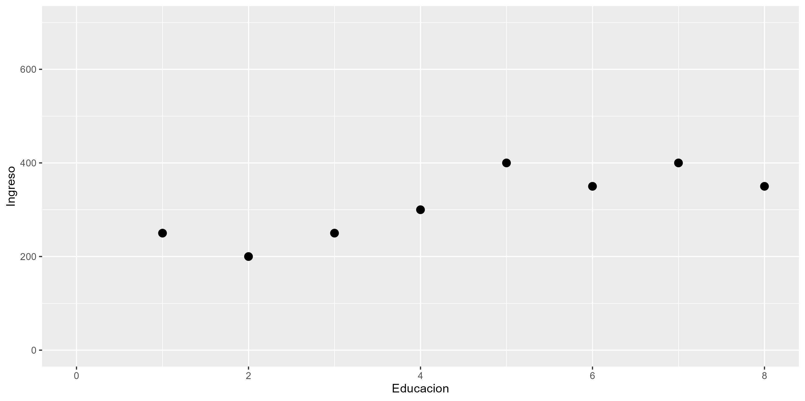
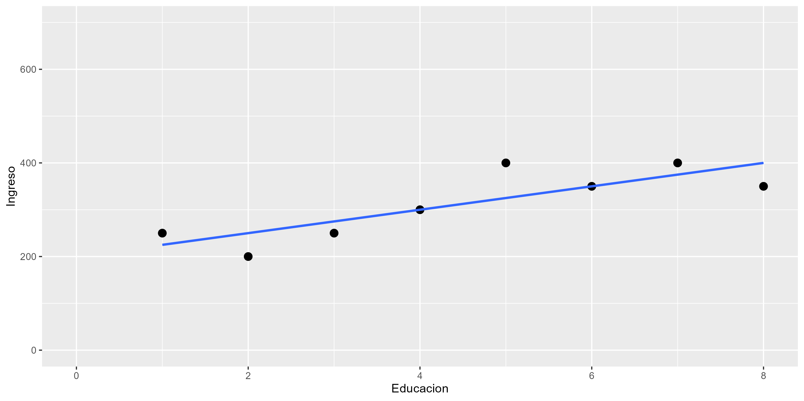
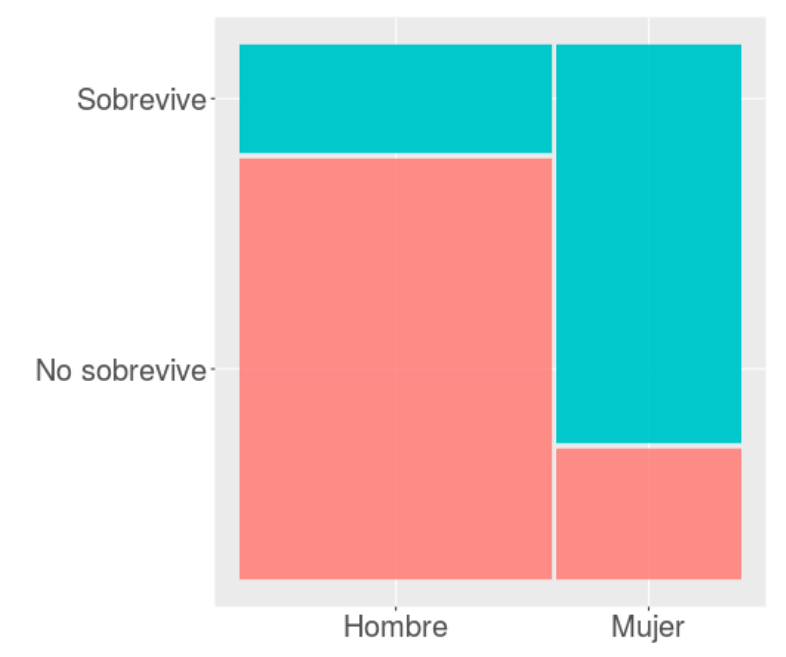

```{r}
#| label: setup
#| include: false
require("knitr")
options(htmltools.dir.version = FALSE)
pacman::p_load(
  RefManageR, flipbookr, tidyverse, broom, sjPlot, sjmisc,
  kableExtra, ggplot2, dplyr, purrr, modelsummary
)
knitr::opts_chunk$set(
  warning = FALSE,
  message = FALSE,
  echo = FALSE,
  cache = FALSE
)
```

##  {data-background-color="black"}

::: {.columns .v-center-container}
::: {.column width="20%"}
{width="100%" fig-align="center"}
:::

::: {.column width="80%"}
::: rojo
### R para el análisis de datos
**Sesión 9**: Regresión logística
:::

------------------------------------------------------------------------

### **Kevin Carrasco**
### Sociología - UAH
### 1er Sem 2026 
### [R-data-analisis.netlify.com](https://R-data-analisis.netlify.com)
:::
:::


## {.inverse .bottom .right data-background-color="black"}

### Contenidos

**1. Repaso de sesión anterior**

**2. Estimación regresión logística**

**3. Ajuste regresión logística**

---

### Asociación: covarianza / correlación

::: {.pull-left}
  _¿Se relaciona la variación de una variable, con la variación de otra variable?_
:::
::: {.pull-right}
::: {.center}
{width=100%}
:::
:::

---

::: {.pull-left}
* Pero ojo, **correlación no implica causalidad**
:::


::: {.pull-right}
{width=100%}
:::

---

### ¿Qué es la regresión lineal?

::: {.fragment}

* Es un modelo estadístico

:::
::: {.fragment}

- Se usa para:

  - **Conocer**: La relación de una variable dependiente de acuerdo a una/otras independiente(s)
  - **Predecir**: Estimar el valor de una variable dependiente de acuerdo al valor de otras
  - **Inferir**: si estas relaciones son estadísticamente significativas
:::

---

### ¿Qué es la regresión lineal?

* Dos tipos de regresión:
  - Regresión lineal simple (una variable independiente)
  - Regresión lineal múltimple (más de una variable independiente)

---

```{r echo=FALSE}
data <- cbind(Educacion=c(1,2,3,4,5,6,7,8),
              Ingreso=c(250,200,250,300,400,350,400,350))
data <- as.data.frame(data)
```


### Ejemplo 


```{r}
data
```

---

### Ejemplo 


```{r echo=FALSE}
plot1<- ggplot2::ggplot(data, aes(x=Educacion, y=Ingreso))+
  geom_point(size=3)+
  scale_x_continuous(breaks = seq(0, 8, by = 1)) +
  scale_y_continuous(breaks = seq(0, 700, by = 100))+
  ylim(0,700)+
  xlim(0,8)

ggsave(plot1, file="../../files/img/plot1.png")
```


{width=100%}


---

### Ejemplo 


```{r warning=FALSE, message=FALSE}
plot2<- ggplot2::ggplot(data, aes(x=Educacion, y=Ingreso))+
  geom_point(size=3)+
  geom_smooth(method = "lm", se=FALSE)+
  scale_x_continuous(breaks = seq(0, 8, by = 1)) +
  scale_y_continuous(breaks = seq(0, 700, by = 100))+
  ylim(0,700)+
  xlim(0,8)

ggsave(plot2, file="../../files/img/plot2.png")
```

{width=100%}


---

### La recta de regresión

$$\widehat{Y}=b_{0} +b_{1}X$$

Donde

- $\widehat{Y}$ es el valor estimado de $Y$

- $b_{0}$ es el intercepto de la recta (el valor de Y cuando X es 0)

- $b_{1}$ es el coeficiente de regresión, que nos dice cuánto aumenta Y por cada punto que aumenta X

---

### Pero este es un curso de R, así que:

```{r}
reg1<-lm(Ingreso~Educacion, data=data)
reg1
```

---

### Ejemplo 

*Por cada unidad que aumenta educación, ingreso aumenta en 25 unidades*


```{r warning=FALSE, message=FALSE}
ggplot2::ggplot(data, aes(x=Educacion, y=Ingreso))+
  geom_point(size=3)+
  geom_smooth(method = "lm", se=FALSE)+
  scale_x_continuous(breaks = seq(0, 8, by = 1)) +
  scale_y_continuous(breaks = seq(0, 700, by = 100))+
  ylim(0,700)+
  xlim(0,8)
```


{width=100%}


---

## {.inverse .bottom .right data-background-color="black"}

### Sesión 8
<br>

Regresión lineal

**R2**

Inferencia

Valores predichos

<br>
<br>
<br>
<br>

---

## Varianza explicada

- ¿Qué porcentaje de la varianza de Y logramos explicar con X?

::: {.fragment}

* **R2** = Porcentaje de la variación de Y puede ser asociado a la variación de X
:::

---

### Ejemplo 

El ajuste del modelo a los datos se relaciona con la proporción de residuos generados por el modelo respecto de la varianza total de Y (R2)

```{r warning=FALSE, message=FALSE}
ggplot2::ggplot(data, aes(x=Educacion, y=Ingreso))+
  geom_point(size=3)+
  geom_smooth(method = "lm", se=FALSE)+
  scale_x_continuous(breaks = seq(0, 8, by = 1)) +
  scale_y_continuous(breaks = seq(0, 700, by = 100))+
  ylim(0,700)+
  xlim(0,8)
```


{width=100%}


---

## {.inverse .bottom .right data-background-color="black"}

### Sesión 8
<br>

Repaso sesión anterior

Regresión lineal

R2

**Inferencia**

Valores predichos

<br>
<br>
<br>
<br>

---

## Inferencia estadística

* ¿Cómo sabemos si $b_{1}$ es estadísticamente significativo?

::: {.fragment}

* ¿Nuestros datos se pueden extrapolar a la población?
:::

---

```{r results='asis'}
texreg::htmlreg(reg1, caption="")
```

---

```{r echo=FALSE}
data <- as.data.frame(cbind(data,
              edad=c(25,20,20,30,45,30,45,40)))
```


```{r results='asis'}
reg2 <- lm(Ingreso~Educacion+edad, data = data)
texreg::htmlreg(reg2, caption="")
```

---

### Parcialización

::: {.center}
{width=50%}
:::


```{r echo=FALSE}
data <- as.data.frame(cbind(data,
              Educacion_rec=c("Basica","Basica","Basica","Media","Media","Superior","Superior","Superior")))
reg3 <-lm(Ingreso~Educacion_rec, data=data)
```

---

#### ¿y la interpretación para variables categóricas?

```{r results='asis'}
texreg::htmlreg(reg3, caption="",
                custom.coef.names = c("Intercepto",
                                     "Educación media",
                                     "Educación superior"))
```


*Las personas que tienen educación media ganan $116mil más en comparación con quienes tienen educación básica, efecto que es estadísticamente significativo (p<0.01)*


---

:::: {.columns}
::: {.column width="40%"}
{width="80%"}
:::
::: {.column width="60%"}
### ¿Se puede anticipar el final?
:::
::::

---

### Titanic data

```{r}
#| echo: false
pacman::p_load(sjmisc, descr, scales, xtable, ggmosaic, stargazer, summarytools, sjPlot, dplyr)
load("titanic.Rdata")
```

```{r}
#| echo: false
tt2 <- tt %>% select(survived, sex, age)
print(dfSummary(tt2, headings = FALSE), method = "render")
```

---

### Sobrevivientes & Sexo

```{r}
#| echo: false
plot1 <- ggplot(tt, aes(survived, fill = survived)) + 
  geom_bar() + 
  geom_text(
    aes(label = scales::percent((..count..)/sum(..count..))),
    stat = 'count', size = 10, vjust = 3) + 
  theme(legend.position = "none", 
        text = element_text(size = 30),
        axis.title = element_blank())
```

:::: {.columns}
::: {.column width="50%"}
```{r}
#| echo: false
#| fig-height: 6
plot1
```
:::
::: {.column width="50%"}
```{r}
#| echo: false
#| fig-height: 6
(ggplot(tt, aes(sex, fill = sex))
 + geom_bar()
 + geom_text(
     aes(label = scales::percent((..count..)/sum(..count..))),
     stat = 'count',
     size = 10,
     vjust = 3)
 + theme(legend.position = "none", text = element_text(size = 30), axis.title = element_blank())
)
```
:::
::::

---

### Sobrevivencia / sexo

::: {.center}
{width="55%"}
:::

---

### Limitaciones modelo de regresión lineal para dependientes dicotómicas (= modelo de probabilidad lineal)

:::: {.columns}
::: {.column width="50%"}
```{r}
#| echo: false
#| results: hide
str(tt$survived)
tt <- tt %>% mutate(survived_n = recode(survived,
  "No sobrevive" = 0, "Sobrevive" = 1))
str(tt$survived_n)
```

```{r}
#| echo: false
#| fig-height: 6
ggplot(data = tt, aes(x = as.numeric(sex), y = survived_n)) +
  geom_point(aes(color = as.factor(survived_n)), shape = 1) +
  geom_smooth(method = "lm", color = "gray20", se = FALSE) +
  theme_bw()  +
  labs(title = "Regresión lineal por mínimos cuadrados",
       y = "Sobrevive") +
  theme(legend.position = "none", text = element_text(size = 20))
```
:::
::: {.column width="50%"}
```{r}
#| echo: false
tt$survived_n2 <- tt$survived_n
tt$survived_n2[tt$age > 40] <- 0
tt$survived_n2[tt$age < 20] <- 1
```

```{r}
#| echo: false
#| fig-height: 6
ggplot(data = tt, aes(x = age, y = survived_n2)) +
  geom_point(aes(color = as.factor(survived_n2)), shape = 1) +
  geom_smooth(method = "lm", color = "gray20", se = FALSE) +
  theme_bw()  +
  labs(title = "Regresión lineal por mínimos cuadrados",
       y = "Sobrevive") +
  theme(legend.position = "none", text = element_text(size = 20))
```
:::
::::

---

### {.inverse .bottom .right data-background-color="black"}

La **regresión logística** ofrece una solución a los problemas del **rango** de predicciones y de **ajuste** a los datos del modelo de probabilidad lineal

::: {.fragment}
### Se logra mediante:
#### (a) expresión de coeficientes como odds-ratio
#### (b) *transformación* de los coeficientes a **LOGIT**
:::

---

### Curvando la recta ...

:::: {.columns}
::: {.column width="50%"}
```{r}
#| echo: false
ggplot(data = tt, aes(x = age, y = survived_n2)) +
  geom_point(aes(color = as.factor(survived_n2)), shape = 1) +
  geom_smooth(method = "lm", color = "gray20", se = FALSE) +
  theme_bw()  +
  labs(title = "Regresión lineal por mínimos cuadrados",
       y = "Sobrevive") +
  theme(legend.position = "none", text = element_text(size = 20))
```
:::
::: {.column width="50%"}
```{r}
#| echo: false
modelo_logistico2 <- glm(survived_n2 ~ age, data = tt, family = "binomial")
```

```{r}
#| echo: false
ggplot(data = tt, aes(x = age, y = survived_n2)) +
  geom_point(aes(color = as.factor(survived_n2)), shape = 1) +
  stat_function(fun = function(x){predict(modelo_logistico2,
                                          newdata = data.frame(age = x),
                                          type = "response")}) +
  theme_bw() +
  labs(title = "Regresión logística",
       y = "Probabilidad sobrevivir") +
  theme(legend.position = "none", text = element_text(size = 20))
```
:::
::::

---

### Odds

- **odds** (chances): probabilidad de que algo ocurra dividido por la probabilidad de que no ocurra

$$Odds=\frac{p}{1-p}$$

::: {.fragment}
Ej. Titanic:

- 427 sobrevivientes (41%), 619 muertos (59%)

$$Odds_{sobrevivir}=427/619=0.41/0.59=0.69$$

**Es decir, las chances de sobrevivir son de 0.69**
:::

---

### Odds ratio (OR)

:::: {.columns}
::: {.column width="50%"}
- los odds-ratio (o razón de chances) permiten reflejar la asociación entre las chances de dos variables dicotómicas

**¿Tienen las mujeres más chances de sobrevivir que los hombres?**
:::
::: {.column width="50%"}
::: {.fragment}
```{r}
sjt.xtab(tt$survived, tt$sex,
        show.col.prc = TRUE,
        show.summary = FALSE)
```
:::
:::
::::

---

### Odds Ratio

**¿Cuántas más chances de sobrevivir tienen las mujeres respecto de los hombres?**

- OR supervivencia mujeres / OR supervivencia hombres

$$OR=\frac{p_{m}/(1-p_{m})}{p_{h}/(1-p_{h})}=\frac{0.753/(1-0.753)}{0.205/(1-0.205)}=\frac{3.032}{0.257}=11.78$$

::: {.fragment}
### Las chances de sobrevivir de las mujeres son **11.78** veces más que las de los hombres.
:::


### {.inverse .bottom .right data-background-color="black"}

# 2. Regresión logística: Estimación

---

### Regresión logística y odds

:::: {.columns}
::: {.column width="50%"}
```{r}
#| echo: false
ggplot(data = tt, aes(x = age, y = survived_n2)) +
  geom_point(aes(color = as.factor(survived_n2)), shape = 1) +
  stat_function(fun = function(x){predict(modelo_logistico2,
                                          newdata = data.frame(age = x),
                                          type = "response")}) +
  theme_bw() +
  labs(title = "Regresión logística",
       y = "Probabilidad sobrevivir") +
  theme(legend.position = "none", text = element_text(size = 20))
```
:::
::: {.column width="50%"}
Una de las transformaciones que permite realizar una estimación de regresión con variables dependientes dicotómicas es el **logit**, que es logaritmo de los odds.
:::
::::

---

### Logit

$$Logit=ln(Odd)=ln(\frac{p}{1-p})$$

---

### Probabilidades, odds y logit

:::: {.columns}
::: {.column width="50%"}
```{r}
#| echo: false
df <- data.frame(matrix(ncol = 3, nrow = 19))
x <- c("prob", "odds", "logit")
colnames(df) <- x
df[is.na(df)] = " "
df$prob <- seq(0.001, 0.999, length.out = 19)
print(df, digits = 3, row.names = FALSE)
```
:::
::: {.column width="50%"}
:::
::::

---

### Probabilidades, odds y logit

:::: {.columns}
::: {.column width="50%"}
```{r}
#| echo: true
#| eval: false
df$odds <- df$prob/(1-df$prob)
df$logit <- log(df$odds)
```
:::
::: {.column width="50%"}
```{r}
#| echo: false
df <- data.frame(matrix(ncol = 3, nrow = 19))
x <- c("prob", "odds", "logit")
colnames(df) <- x
df[is.na(df)] = " "
df$prob <- seq(0.001, 0.999, length.out = 19)
df$odds <- df$prob/(1-df$prob)
df$logit <- log(df$odds)
print(df, digits = 3, row.names = FALSE)
```
:::
::::

---

### Probabilidades, odds y logit (destacado)

:::: {.columns}
::: {.column width="50%"}
```{r}
#| echo: true
#| eval: false
df$odds <- df$prob/(1-df$prob)
df$logit <- log(df$odds)
```
:::
::: {.column width="50%"}
```{r}
#| echo: true
#| eval: false
##    prob     odds  logit
##  0.0010   0.0010 -6.907  # <
##  0.0564   0.0598 -2.816
##  0.1119   0.1260 -2.072
##  0.1673   0.2010 -1.605
##  0.2228   0.2866 -1.250
##  0.2782   0.3855 -0.953
##  0.3337   0.5008 -0.692
##  0.3891   0.6370 -0.451
##  0.4446   0.8004 -0.223
##  0.5000   1.0000  0.000  # <
##  0.5554   1.2494  0.223
##  0.6109   1.5700  0.451
##  0.6663   1.9970  0.692
##  0.7218   2.5942  0.953
##  0.7772   3.4888  1.250
##  0.8327   4.9761  1.605
##  0.8881   7.9374  2.072
##  0.9436  16.7165  2.816
##  0.9990 999.0000  6.907  # <
```
:::
::::

---

### Estimación en R: `glm`

```r
modelo <- glm(dependiente ~ indep1 + indep2 + ...,
          data = datos,
          family = "binomial")
```

- `glm` (general lineal model) es la función para variables dependientes categóricas

- `family="binomial"` indica que la dependiente es dicotómica

---

### Ejemplo Titanic

:::: {.columns}
::: {.column width="50%"}
```{r}
#| echo: true
modelo_titanic <-
glm(survived ~ sex,
data = tt,
family = "binomial")
```
:::
::: {.column width="50%"}
```{r}
#| results: asis
#| echo: false
or <- texreg::extract(modelo_titanic)
or@coef <- exp(or@coef)
or@se <- numeric()

texreg::htmlreg(list(modelo_titanic, or), doctype = FALSE, caption = " ",
                custom.coef.names = c("Intercepto", "Mujer (Ref=Hombre)"),
                custom.model.names = c("Logit", "OR"), digits = 3)
```
:::
::::

---

### Interpretación de asociaciones y contraste de hipótesis

### Coeficiente logit asociado a sexo (mujer) = +2.467:

- El log-odds de sobrevivencia aumenta para las mujeres en 2.467 en comparación con los hombres.

::: {.fragment}
### Contraste de hipótesis

- La diferencia de las probabilidades de sobrevivir entre hombres y mujeres son estadísticamente significativas, por lo que se rechaza la hipótesis nula (de ausencia de diferencias entre hombres y mujeres) con un nivel de probabilidad $p<0.001$.
:::

---

### Interpretación de coeficientes logit

- Sustantivamente no nos dice mucho, ya que el logit es una transformación de la escala original.

- Por lo tanto, para poder interpretar el sentido del coeficiente se requiere volver a la métrica de odds mediante una transformación inversa o **exponenciación**

---

### De logits a odds

:::: {.columns}
::: {.column width="50%"}
$$logit_x=log(Odds)$$
$$e^{logit}=Odds_X$$
$$e^{2.467}=11.78$$
:::
::: {.column width="50%"}
```{r}
#| echo: true
exp(2.467)
```
### Las chances (odds) de sobrevivir siendo mujer son **11.78** veces más que las de un hombre.
:::
::::

---

## De logits a odds

$$Odds_X=e^{\beta_0 + \beta_jX_j}$$

::: {.fragment}
- Predicción para **mujeres** = -1.354 + (2.467 * Sexo=1) = 1.113

- Predicción para **hombres** = -1.354 + (2.467 * Sexo=0) = -1.354
:::

::: {.fragment}
$$Odds_{mujer}=e^{1.113}=3.032$$
$$Odds_{hombre}=e^{-1.354}=0.257$$
:::

---

### Regresión logística simple para independientes continuas

:::: {.columns}
::: {.column width="50%"}
```{r}
#| echo: true
modelo_titanic_age <-
glm(survived ~ age,
data = tt,
family = "binomial")
```
:::
::: {.column width="50%"}
```{r}
#| results: asis
#| echo: false
or <- texreg::extract(modelo_titanic_age)
or@coef <- exp(or@coef)
or@se <- numeric()

texreg::htmlreg(list(modelo_titanic_age, or), doctype = FALSE, caption = " ",
                custom.coef.names = c("Intercepto", "Edad"),
                custom.model.names = c("Logit", "OR"), digits = 3)
```
:::
::::

---

### Plot probabilidades predichas

::: {.center}
```{r}
ggplot(tt, aes(x = age, y = survived_n2)) + 
  geom_point(alpha = .5) +
  stat_smooth(method = "glm", se = FALSE, method.args = list(family = binomial))
```
:::

---

### Regresión logística múltiple

:::: {.columns}
::: {.column width="50%"}
```{r}
#| echo: true
modelo_titanic2 <-
glm(survived ~ sex + age,
data = tt,
family = "binomial")
```
:::
::: {.column width="50%"}
```{r}
#| results: asis
#| echo: false
or2 <- texreg::extract(modelo_titanic2)
or2@coef <- exp(or2@coef)
or2@se <- numeric()

texreg::htmlreg(list(modelo_titanic2, or2), doctype = FALSE, caption = " ",
                custom.coef.names = c("Intercepto", "Mujer (Ref=Hombre)", "Edad"),
                custom.model.names = c("Logit", "OR"))
```
:::
::::

---

##  {data-background-color="black"}

::: {.columns .v-center-container}
::: {.column width="20%"}
{width="100%" fig-align="center"}
:::

::: {.column width="80%"}
::: rojo
### R para el análisis de datos
**Sesión 9**: Regresión logística
:::

------------------------------------------------------------------------

### **Kevin Carrasco**
### Sociología - UAH
### 1er Sem 2026 
### [R-data-analisis.netlify.com](https://R-data-analisis.netlify.com)
:::
:::