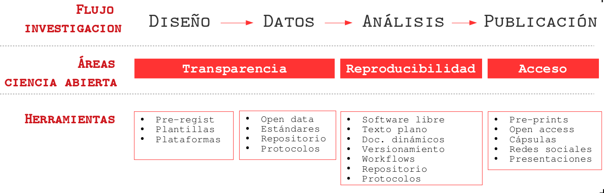
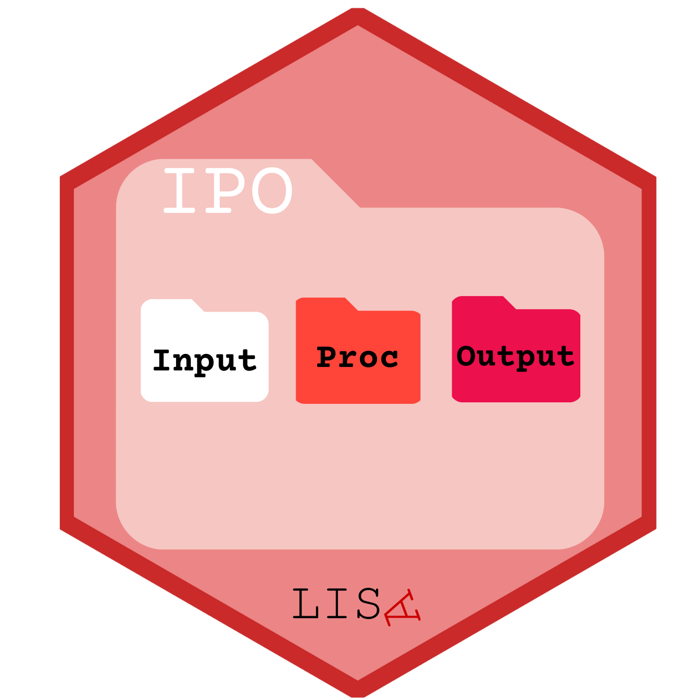
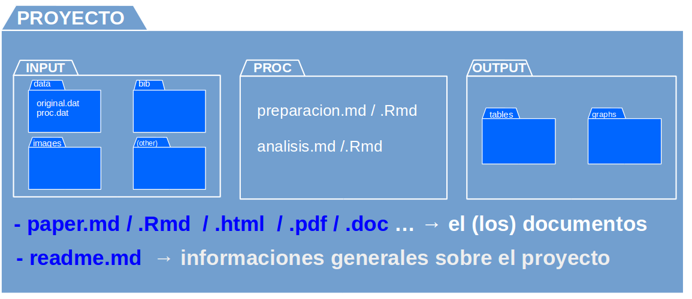

##  {data-background-color="black"}

::: {.columns .v-center-container}
::: {.column width="20%"}
{width="100%" fig-align="center"}
:::

::: {.column width="80%"}
::: rojo
### R para el análisis de datos
:::

------------------------------------------------------------------------

### **Kevin Carrasco**
### Sociología - UAH
### 1er Sem 2026 
### [R-data-analisis.netlify.com](https://R-data-analisis.netlify.com)
:::
:::

## Este curso 
::: {.incremental}

* Unidad 1: Elementos y herramientas de R

* Unidad 2: Operacionalización y análisis descriptivo de datos

* Unidad 3: Análisis estadístico bivariado en R

* Unidad 4: Regresión lineal y regresión logística
:::

## Evaluación
::: {.incremental}


- **Para presentarse a examen se requiere una nota promedio igual o superior a 3,5 y un 70% de asistencia al curso. Esta regla solo podrá alterarse en caso de inasistencias por causas serias y justificadas de acuerdo con el criterio de la carrera.**

- 4 trabajos (15% c/u). En parejas

- Presentación final de investigación (10%)

- Examen Final (30%)

- Foco en reproducibilidad, reporte, visualización y análisis de resultados.

:::

## Ciencia abierta




# Investigación reproducible {data-background-color="black"}

## Reproducibilidad

::: {.incremental}


- Es la posibilidad de **regenerar** de manera independiente los resultados usando los materiales originales de una investigación ya publicada.

- En términos simples: obtener los mismos resultados de una investigación utilizando los mismos datos.

:::


# Flujos de investigación reproducible {data-background-color="black"}

- Texto plano
- Carpetas y archivos
- Autocontenido
- Abierto

# Propuesta: escritura libre y abierta

##  Documentos en Quarto


## Características Principales

-   **Multiplataforma**

-   **Basado en Markdown** 

-   **Soporte para múltiples lenguajes** 

-   **Multitud de formatos de salida** 

-   **Soporte para publicación científica** 
  
-   **Integración entornos de desarrollo** (RStudio, VSC, etc)

-   **Extensible** 

---

## Características principales

- Lenguaje que combina código (R) y texto (Markdown): Al igual que RMarkdown (.Rmd), Quarto permite combinar texto plano markdown y código de análisis R.

- Provee una serie de herramientas para generar documentos dinámicos y publicarlos


## Estructura de un documento

- Archivo `.qmd`
- Encabezado YAML:
  ```yaml
  title: "Mi documento"
  author: "Kevin Carrasco"
  date: today
  format: html
  ```
- Cuerpo:
  - Markdown para secciones, énfasis, listas, etc.
  - Bloques de código
  - Bibliografía

## Base de escritura: Markdown

:::: {.columns}
::: {.column width="60%"}
- Encabezados: `#`, `##`, `###`
- Listas:
  - Viñetas: `-` o `*`
  - Numeradas: `1.`, `2.`
- Énfasis: `*cursiva*`, `**negrita**`
- Código en línea: `` `código` ``
- Enlaces: `[texto](url)`
:::

::: {.column width="40%"}

:::
::::

## Personalización visual del HTML

- Temas: `cosmo`, `flatly`, `lux`, `darkly`, etc.
- Opciones comunes en YAML:
  ```yaml
  toc: true
  number-sections: true
  code-fold: true
  theme: darkly
  ```
- Personalización con CSS externo:
  ```yaml
  css: estilos.css
  ```

## Ejemplo

    --- # <1>
    title: "Tutorial Quarto" # <1>
    author: "Kevin Carrasco" # <1>
    date: "2026-03-10" # <1>
    format: html # <1>
    lang: es # <1>
    toc: true
    number-sections: true
    theme: darkly
    --- # <1>

    # Bienvenidos a este tutorial de **Quarto**. # <2>

    Quarto está especialmente diseñado para elaborar documentos # <2>
    científicos y técnicos reproducibles

    ## Este es un subtítulo

    Ahora vamos a ensayar **negritas** y _cursivas_

    ### Y un título de tercer orden

    Y una lista

    - con viñetas
    - ...
    - ...
  
    Y otra numerada:

    1. punto 1
    2. punto 2
    3. ...


## Extensiones

- Integración con R
- Referencias bibliográficas
- Renderizado a pdf, word
- Sitios web
- Presentaciones

## Recursos

- Recursos para seguir aprendiendo:
- [https://quarto.org](https://quarto.org)
- [Creación de documentos científicos con Quarto](https://aprendeconalf.es/quarto-textos-cientificos/)
- [Tutorial Quarto for academics](https://youtu.be/EbAAmrB0luA)

## Propuesta: **Protocolo IPO**



## Estructura IPO



## Carpeta autocontenida

- proyecto **autocontenido**: reproducible sin necesidad de archivos externos

- requisito: establecer **directorio de trabajo**

  - posición de referencia de todas las operaciones al interior del proyecto
  
  - también llamado **directorio raíz**
  
## Directorio de trabajo

- ej. forma tradicional en hoja de código R: 

  - `setwd(ruta-a-carpeta-de-proyecto)`

  - problemas: hace referencia a ruta local en el computador donde se está trabajando, por lo tanto no es reproducible y **se debe evitar**
  
- alternativa sugerida en R: **RStudio Projects**  

## RStudio Projects

- La funcionalidad **Projects** de RStudio permite establecer claramente un directorio de trabajo de manera eficiente

- Para ello, genera un archivo de extensión **.Rproj** en el directorio raiz de la carpeta del proyecto

- Luego se facilita acceder a la carpeta del proyecto en RStudio ejecutando desde el administrador de archivos del computador (file manager) el archivo **.Rproj** 

- para comprobar, ejecutar `getwd()` y debería dar la ruta hacia la carpeta del proyecto

# Repositorios y apertura {data-background-color="black"}

## {data-background-color="black"}

### [Git no es un registro de versiones de archivos específicos, sino de una carpeta completa]{.red}

### [Guarda *"fotos"* de momentos específicos de la carpeta, y esta foto se *saca* mediante un]{.red} **commit**

##


## Commits

- El **commit** es el procedimiento fundamental del control de versiones

- Git no registra cualquier cambio que se "guarda", sino los que se "comprometen" (commit).

- En un **commit**
  - se seleccionan los archivos cuyo cambio se desea registrar (*stage*)
  - se registra lo que se está comprometiendo en el cambio (mensaje de commit)

## ¿Cuándo hacer un commit?

- según conveniencia

- sugerencias:

  - que sea un momento que requiera registro (momento de foto)
  
  - no para cambios menores
  
  - no esperar muchos cambios distintos que puedan hacer perder el sentido del commit


# Uso de inteligencia artificial en el curso {data-background-color="black"}

## Inteligencia artificial

- Se puede usar inteligencia artificial para generar código, pero es importante revisar y entender el código generado, ya que puede contener errores o no ser óptimo.

- Se recomienda usar inteligencia artificial como una herramienta de apoyo, pero no como un sustituto del aprendizaje y la comprensión de los conceptos fundamentales de R y el análisis de datos.

- Se pueden usar herramientas como ChatGPT, pero es importante ser crítico con las respuestas generadas y verificar su precisión.

# Qué se espera en los trabajos {data-background-color="black"}

## Estructura de carpetas


## Repositorio


## GitHub Pages


##  {data-background-color="black"}

::: {.columns .v-center-container}
::: {.column width="20%"}
{width="80%" fig-align="right"}
:::

::: {.column width="80%"}
::: rojo
R para el análisis de datos
:::

------------------------------------------------------------------------

### **Kevin Carrasco**
### Sociología - UAH
### 1er Sem 2026
### [R-data-analisis.netlify.com](https://R-data-analisis.netlify.com)
:::
:::
